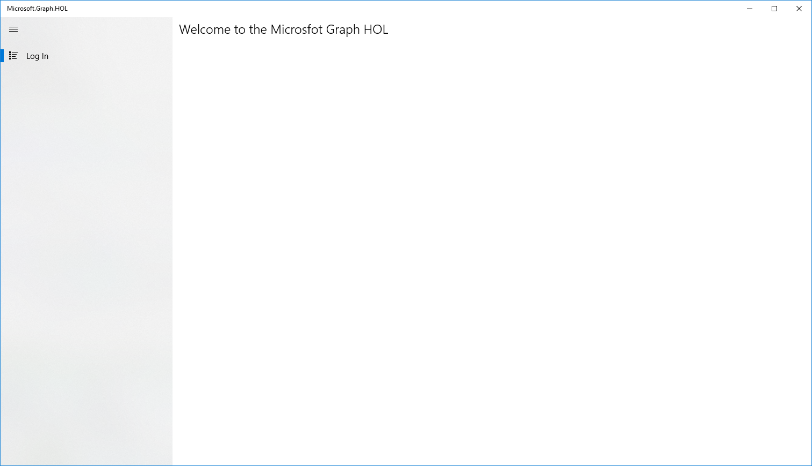

In order for our applications to use the Microsoft Graph API, we must have an application ID.

We must register the application in the Microsoft Application Registry. 

> Note: You will need either a <a href="https://developer.microsoft.com/office/dev-program" target="_blank">school or work</a> or <a href="https://signup.live.com/signup?wa=wsignin1.0&ct=1473983465&rver=6.6.6556.0&wp=MBI_SSL&wreply=https://outlook.live.com/owa/&id=292841&CBCXT=out&cobrandid=90015&bk=1473983466&uiflavor=web&uaid=3b7bae8746264c1bacf1db2b315745cc&lc=1033&lic=1" target="_blank">Microsoft account</a>

### Setting up App ID
Now you need to register your application in the Microsoft Application Registration Portal:

1. Sign in to the <a href= "https://portal.azure.com/">Azure portal</a>.
2. If your account is present in more than one Azure AD tenant, select **Directory + Subscription** at the top-right corner in the menu on top of the page, and switch your portal session to the desired Azure AD tenant.
3. Navigate to the Microsoft identity platform for developers <a href= "https://go.microsoft.com/fwlink/?linkid=2083908">App registrations </a> page.
4. Select **New registration**. 
	- In the **Name** section, enter a meaningful application name that will be displayed to users of the app, for example `UWP-App-calling-MSGraph`.
	- In the **Supported account types** section, select **Accounts in any organizational directory and personal Microsoft accounts** (e.g. Skype, Xbox, Outlook.com).
	- Select **Register** to create the application.
5. On the app **Overview** page, find the **Application (client) ID value** and record it for later. Go back to Visual Studio, open **MainPage.xaml.cs**, and replace the value of ClientId with the Application ID you just registered:

6. In the list of pages for the app, select **Authentication**. 
a. In the Redirect URIs section, in the Redirect URIs list:
b. In the TYPE column select Public client (mobile & desktop).
c. Enter `urn:ietf:wg:oauth:2.0:oob` in the **REDIRECT URI** column.

7. Select **Save**.
8. In the list of pages for the app, select **API permissions**.  
	- Click the **Add a permission** button
	- Ensure that the **Microsoft API's** tab is selected
	- In the **Commonly used Microsoft APIs** section, click on **Microsoft Graph**
	- In the **Delegated permissions** section, ensure that the right permissions are checked: **User.Read**. Use the search box if necessary.
	- Select the **Add permissions** button

### Choosing the project template

Now we will download a UWP application. We will use it and configure it with the Application Id and the Redirect Uri that we saved before.

**Note**: If you want to access quick start samples without downloading from the quick start page, they are also available on GitHub. You can find them <a href="https://docs.microsoft.com/en-us/graph/quick-start-faq">here</a>. 
	 
#### Download UWP project from Github 

Download project from <a href="https://github.com/Microsoft/InsiderDevTour18-Labs/tree/master/graph/Microsoft.GraphBase" target="_blank">here</a>. 

#### Build and Debug

Now we configure the app with the Application Id and Redirect URI.
Open the App.xaml file and add this code:

	<Application.Resources>
        <x:String x:Key="ida:ClientID">ENTERYOURCLIENTID</x:String>
        <x:String x:Key="ida:ReturnUrl">ENTERYOURREDIRECTURI</x:String>
    </Application.Resources>

> Change **ENTERYOURCLIENTID** for your Application Id and **ENTERYOURREDIRECTURI** for the Redirect Uri we saved before

 
To Build and run the applications follow this steps.

1. Now select x86 as build target.
2. Select Local Machine.
3. Build the application.
4. Run the application.

If everything is properly configured you will see:

 
