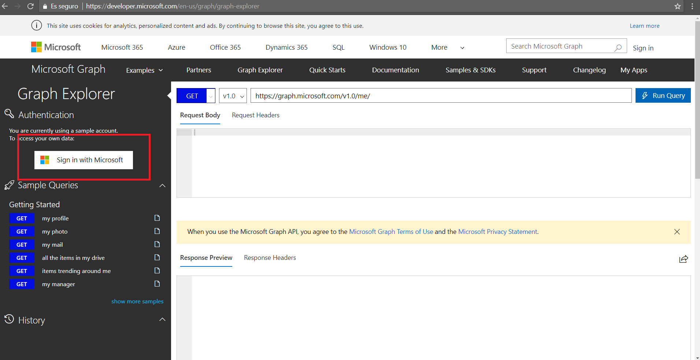
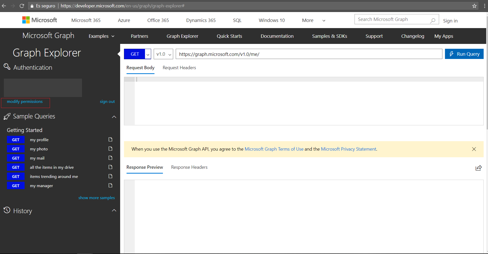
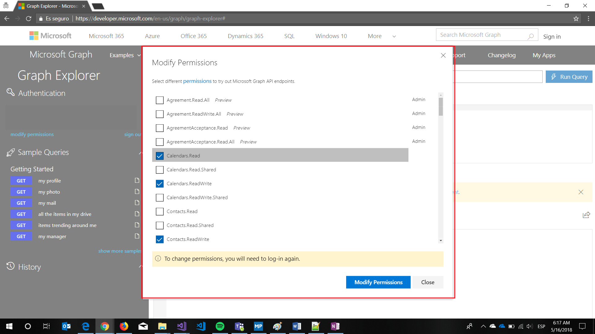
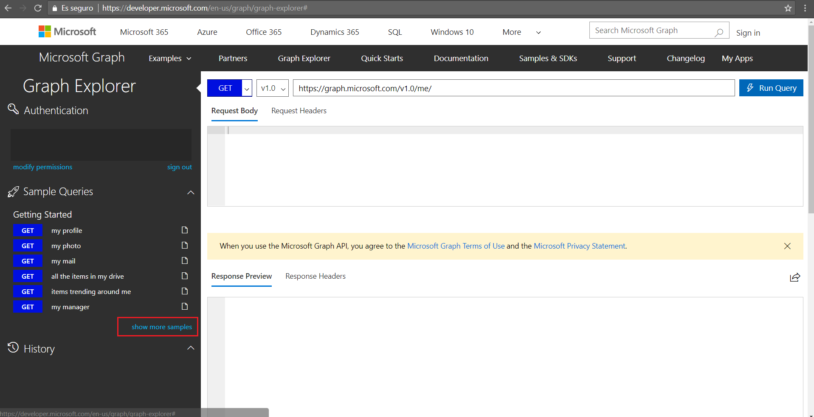
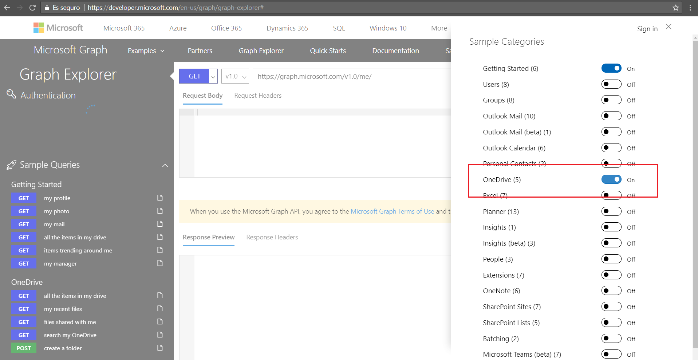
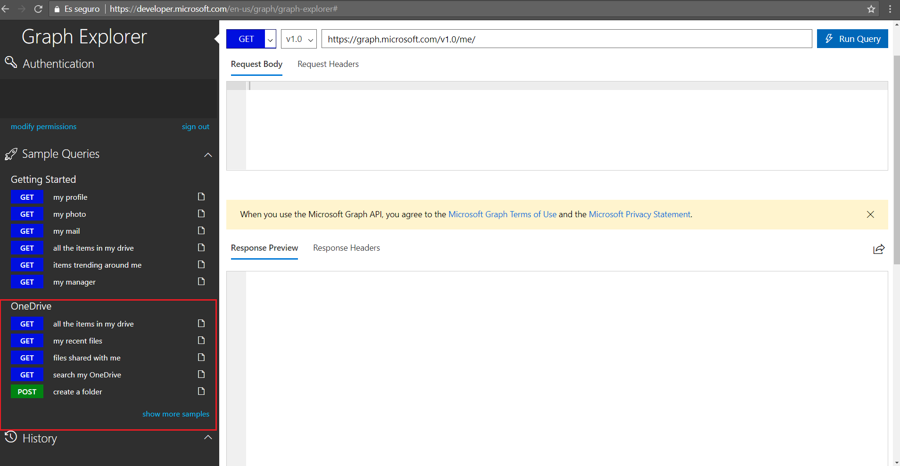
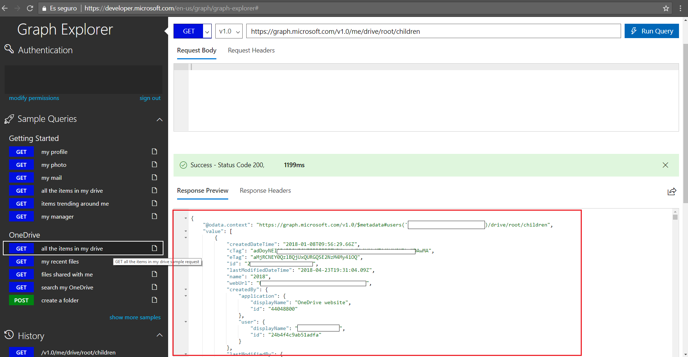

Microsoft Graph Explorer is a tool that allows us to explore and test the Microsoft Graph API.

We are going to take a tour of this tool.

### Sign in to Microsoft Graph Explorer

Go to **<a href="https://developer.microsoft.com/graph/graph-explorer" target="_blank">Microsoft Graph Explorer</a>** and click on the **Sign in With Microsoft** button. 

  

> Note: You will need login with a <a href="https://developer.microsoft.com/office/dev-program" target="_blank">school or work</a> or <a href="https://signup.live.com/signup?wa=wsignin1.0&ct=1473983465&rver=6.6.6556.0&wp=MBI_SSL&wreply=https://outlook.live.com/owa/&id=292841&CBCXT=out&cobrandid=90015&bk=1473983466&uiflavor=web&uaid=3b7bae8746264c1bacf1db2b315745cc&lc=1033&lic=1" target="_blank">Microsoft account</a>

After the login you can see that on the left side we have several options:

- We can modify our permissions.
- We can log out.
- We can see the APIS with some services by default but we can add APIS from show more samples button.

On the right side we have the view with everything we need to launch the calls against the APIs and see the requests and the response.

Now we will see how to test the Microsoft Graph API in Microsoft Graph Explorer by getting all files in One Drive and how we can manage our permissions.

### Modify user permissions

In order to use and access the different services, we can modify the permissions of our user to give him the necessary privileges to be able to use the desired operations.

- Choose Modify Permissions.

  

- Now we can see the list of permissions and you can activate or deactivate individual permissions.

 

### Activate OneDrive in Sample Categories

Now we are going to add the OneDrive APIs to Microsoft Graph Explorer to be able to call these services

- Choose show more samples.

 

- Find OneDrive and activate it. 

 

- Now OneDrive APIs are included in Microsoft Graph Explorer.

 

### Get all items in my drive

We are ready to get all items from OneDrive

- Select in the left menu **all the items in my drive** under **OneDrive** section
- The Microsoft Graph Explorer automatically sends a call to OneDrive API and shows the results.

 

Now let's get a single file.  
From the left panel select my recent files and copy the id field in the remoteItem object.
To get the single file, put it in the url:

	https://graph.microsoft.com/v1.0/me/drive/items/{your_file_id}

If you want the thumbnails, use this url:

	https://graph.microsoft.com/v1.0/me/drive/items/{your_file_id}/thumbnails
