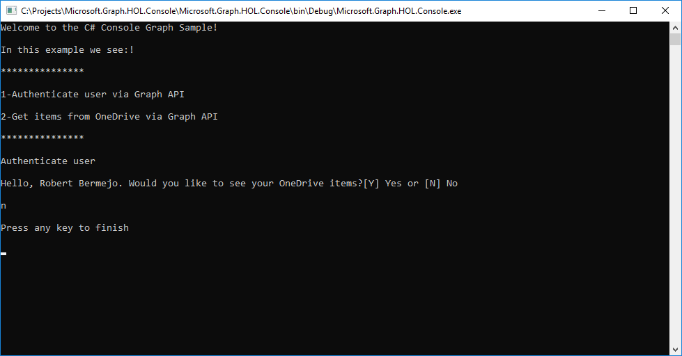
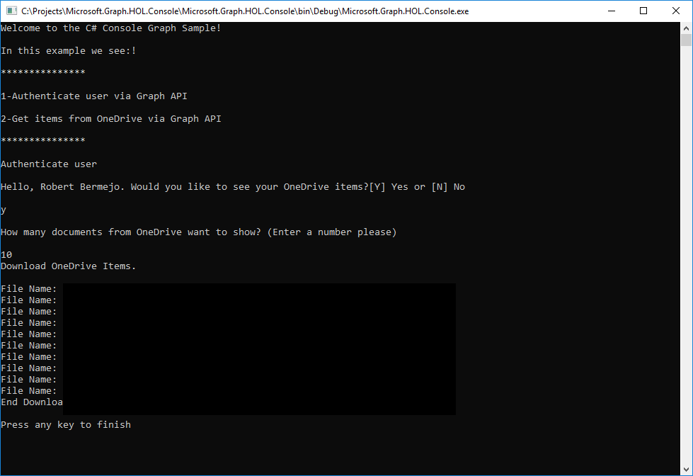

At this point we are ready to interact with Microsoft Graph.

To do this we will create a console application to which we add the necessary code to perform authentication using Microsoft Graph and then we will list all the documents that we have in OneDrive.

### Create a console app

Download the base project from <a href="https://github.com/Microsoft/InsiderDevTour18-Labs/tree/master/graph/Microsoft.Graph.HOL.ConsoleBase" target="_blank">here</a>

### Authenticate user

Now let's add the authentication.

- In App.config add the following underneath the root `<configuration>` tag:

    	<appSettings>
    		<add key="ida:ClientID" value="YOURCLIENTID"/>
    		<add key="ida:ReturnUrl" value="YOURREDIRECTURI"/>
    	</appSettings>
    
	
>Change the value **YOURCLIENTID** for the Application Id that we obtained when registering the application, and do the same with **YOURREDIRECTURI**

- Go to AuthenticationHelper.cs
- Delete the code

   	`throw new NotImplementedException();`

- Add the following code

	      try
            {
                graphClient = new GraphServiceClient(
                    "https://graph.microsoft.com/v1.0",
                    new DelegateAuthenticationProvider(
                        async (requestMessage) =>
                        {
                            var token = await GetTokenForUserAsync();
                            requestMessage.Headers.Authorization = new AuthenticationHeaderValue("bearer", token);                            

                        }));
                return graphClient;
            }

            catch (Exception ex)
            {
                Debug.WriteLine("Could not create a graph client: " + ex.Message);
            }

            return graphClient;

> **Note:** if you see errors underlined in the file, they should disappear when the application is built.

You can see that we use the Microsoft Graph Service Client to authenticate, obtain the token, and later access all of Microsoft Graph resources through the class found in the Microsoft.Graph NuGet package.

The method **GetTokenForUserAsync** obtain the access token after the user are authenticated to send in Authentication header when call the API.

Now you can build and run the process and the application will ask for user credentials via Microsoft Graph.
When you are authenticated, please answer **N** to the answer **Would you like to see your OneDrive items?[Y] Yes or [N] No**

> **Note:** If you receive an error when signing in about no reply address being registered, then you forgot to save your native application addition in step 6 of the **Setting up app id** section.

> **Note:** If you see an error such as _No reply address is registered for the application._ ensure that you hit **Save** when you registered your app in the App Registration Portal.

### Call to Get all items in OneDrive
Now we are ready to make calls to the API, we will call OneDrive API to show the name of the documents we have.

> **Note:** The application ask for a number of documents to show. If you don't want to wait a long time, enter a small number.

For the call to **OneDrive** follow these steps:

- Go to OneDriveHelper.cs.
- Delete the code.
	
	`throw new NotImplementedException();`
-  Add this code:
 			
	       List<string> filesName = new List<string>();

            try
            {
                var graphClient = AuthenticationHelper.GetAuthenticatedClient();
                var onedrive = graphClient.Me.Drive.Root.Children.Request().GetAsync().Result;

                filesName = GetNameFiles(graphClient, filesName, onedrive, numberOfElements);
               
                return filesName;
            }

            catch (Exception ex)
            {
                Debug.WriteLine("Could not create a graph client: " + ex.Message);
                throw;
            }

There are few interesting points in the code before:

- We call the authentication method to obtain the Microsoft Graph context with the authenticated user.
- After that we can access the different Microsoft Graph resources of the user.
- In our case we access the root of OneDrive.
- And then we search for the files by going through all the folders with the recursive GetNameFiles method.

### Adding API calls to your project

Now we have an overview about how to work with Microsoft Graph. Next we will go back to our UWP app and add user authentication.

#### Add user authentication with Microsoft Graph
Open your UWP project in Visual Studio and follow these steps.

- Go to Helpers/AuthenticationHelper.cs
- In GetAuthenticatedClient() Method
- Delete this code:

   	`throw new NotImplementedException();`

- Add the following code:

		if (graphClient == null)
            {
                // Create Microsoft Graph client.
                try
                {
                    graphClient = new GraphServiceClient(
                        "https://graph.microsoft.com/v1.0",
                        new DelegateAuthenticationProvider(
                            async (requestMessage) =>
                            {
                                var token = await GetTokenForUserAsync();
                                requestMessage.Headers.Authorization = new AuthenticationHeaderValue("bearer", token);
                            }));
                    return graphClient;
                }

                catch (Exception ex)
                {
                    Debug.WriteLine("Could not create a graph client: " + ex.Message);
                }
			}
			return graphClient;

As you can see it is exactly the same code that we used in the console application, and this is because for the UWP application we have used the same NuGet package.

> **Note:** In previous steps we configured the **ClientID** and **ReturnURL** field in the App.xaml file. Check that you have added them correctly.

Now run the application and click the **Log in** menu button to authenticate.
