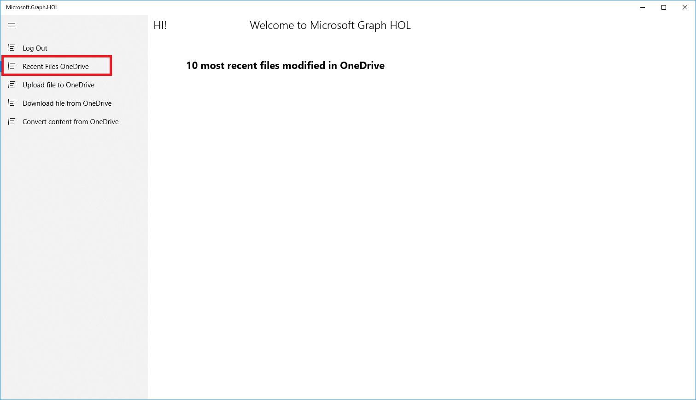
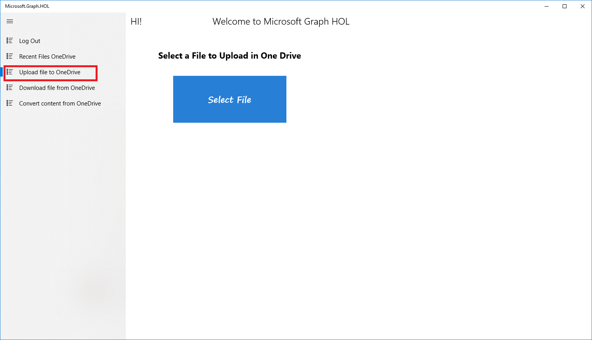
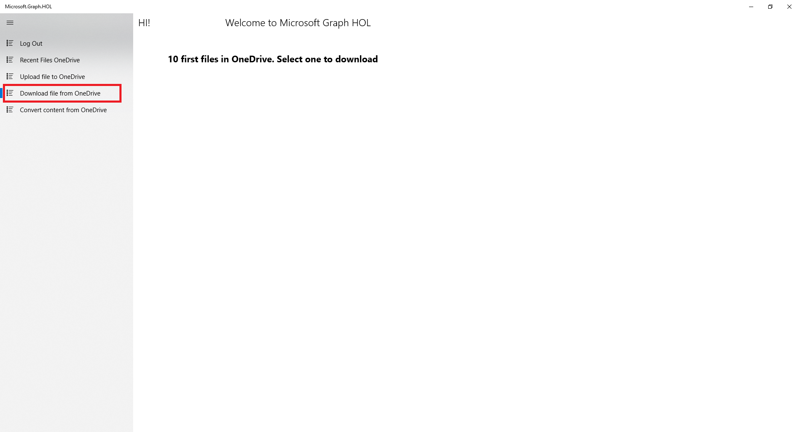
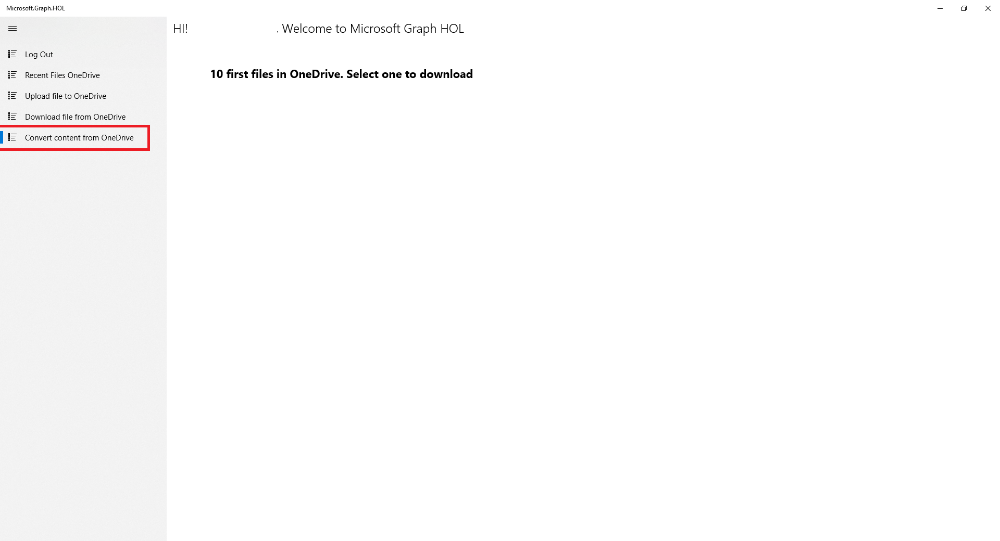

### Accessing file data

What we are going to do in this module is to retrieve the list of the most recent OneDrive documents, building on the knowledge acquired in the Sample API Calls Module.

### Get my recent files from OneDrive from the Microsoft Graph API

In the UWP project go to **Helpers/OneDriverHelper.cs** GetRecentItems method and follow these steps:

- Delete the code

	`throw new NotImplementedException();`

- Add the following code

         	List<DriveItem> filesName = new List<DriveItem>();

            try
            {
                var graphClient = AuthenticationHelper.GetAuthenticatedClient();

                var onedrive = graphClient.Me.Drive.Recent().Request().GetAsync().Result;
                filesName = onedrive.Take(10).ToList();
                return filesName;
            }

            catch (Exception ex)
            {
                Debug.WriteLine("Error get recent files in One Drive: " + ex.Message);
                throw;
            }

After getting graphClient we can access to OneDrive via graphClient.Me.Drive and via the Recent Method get the most recent files.

- Build and run the application.
- Click the Log in button to authenticate.
- After the authentication appears a **Recent File OneDrive** button. Click on this button.
- The application displays the first ten documents that have been modified recently

 

### Writing data to OneDrive
Until now, we have seen how to obtain data through the Microsoft Graph, specifically OneDrive.

Now we will see how we can also use the Microsoft Graph to save data. In this case we will select a file and upload it to OneDrive through the Microsoft Graph API.

Let's go for it!

### Set file location in OneDrive from the Microsoft Graph API.

In the UWP project go to **Helpers/OneDriverHelper.cs** UploadItem method and follow the steps:

- Delete the code

	`throw new NotImplementedException();`

- Add the following code

            try
            {
                var graphClient = AuthenticationHelper.GetAuthenticatedClient();

                var randomAccessStream = await storageFile.OpenReadAsync();
                
                using (var contentStream = randomAccessStream.AsStreamForRead())
                {
                    var uploadedItem = await graphClient
                                                 .Drive
                                                 .Root
                                                 .ItemWithPath($"Hol/Graph/{storageFile.Name}")
                                                 .Content
                                                 .Request()
                                                 .PutAsync<DriveItem>(contentStream);
                }
            }
            catch (Exception ex)
            {
                Debug.WriteLine("Error get upload file in OneDrive: " + ex.Message);
                throw;
            }

> **Note:** The file will be created in the **Hol/Graph** folder. 

### Select the file & save to OneDrive

- Build and run the application.

- Click the Log In button to authenticate.

- After the authentication choose **Upload file to OneDrive** button.

- Click the **Select File** button. Max file size is 2 Mb.

- Select a file from your computer.

- After selecting the file, it is automatically uploaded to your OneDrive.

- Open your OneDrive folder and you can see the file in the Hol/Graph/ folder

> **Note:** If you want to upload large files, visit this <a href="https://docs.microsoft.com/onedrive/developer/rest-api/api/driveitem_createuploadsession" target="_blank">link</a>.

 

## Accessing file contents

In this section we will see how to download OneDrive documents with the Microsoft Graph API and how to download OneDrive documents in a **different format** from the original.

### Download file from OneDrive

In the UWP project go to **Helpers/OneDriverHelper.cs** DownloadFile method and follow the steps:

- Delete the code

	`throw new NotImplementedException();`

- Add the following code

          	try
            {
                var graphClient = AuthenticationHelper.GetAuthenticatedClient();                
                return await graphClient.Me.Drive.Items[driveItem.Id].Content.Request().GetAsync();
            }
            catch (Exception ex)
            {
                Debug.WriteLine("Error download file in OneDrive: " + ex.Message);
                throw;
            }

- Build and run the application.

- Click on the Log in button.

- Select **Download file from OneDrive** option in menu. Show the 10 first items in OneDrive.

- Select the file and click download. The file will be saved in the **Pictures Folder**.

- Go to the **Pictures Folder** and see that the file is there and open it.

 

### Convert content from OneDrive file

In the UWP project go to **Helpers/OneDriverHelper.cs** ConvertContetPDF method and follow the steps:

- Delete the code

	`throw new NotImplementedException();`

- Add the following code

            if(!ValidateExtension(driveItem.Name))
            {
                throw new Exception("File extension incorrect. Only accepts doc, docx, epub, eml, htm, html, md, msg, odp, ods, odt, pps, ppsx, ppt, pptx, rtf, tif, tiff, xls, xlsm, xlsx");
            }
            try
            {
                var graphClient = AuthenticationHelper.GetAuthenticatedClient();
                List<QueryOption> queryOptionsList = new List<QueryOption>()
                {
                    new QueryOption("format", "pdf")
                };                

                return await graphClient.Me.Drive.Items[driveItem.Id].Content.Request(queryOptionsList).GetAsync();
            }
            catch (Exception ex)
            {
                Debug.WriteLine("Error convert content in OneDrive: " + ex.Message);
                throw;
            }

> **NOTE:** First validate that the file extension can be converted. Not all extensions can be converted and in our example we convert the document to pdf. To see all the conversions, visit this <a href="https://docs.microsoft.com/onedrive/developer/rest-api/api/driveitem_get_content_format" target="_blank">link</a>.

- Build and run the application.

- Click on Log in button.

- Select the **Convert content from OneDrive** option in menu.

- Select a file with one of these extensions: doc, docx, epub, eml, htm, html, md, msg, odp, ods, odt, pps, ppsx, ppt, pptx, rtf, tif, tiff, xls, xlsm, xlsx

- Select the file and click convert and download. The file will be saved in the **Pictures Folder** with the same name but with a pdf extension.

- Go to **Pictures Folder** and see that the file is there and open it.

 
