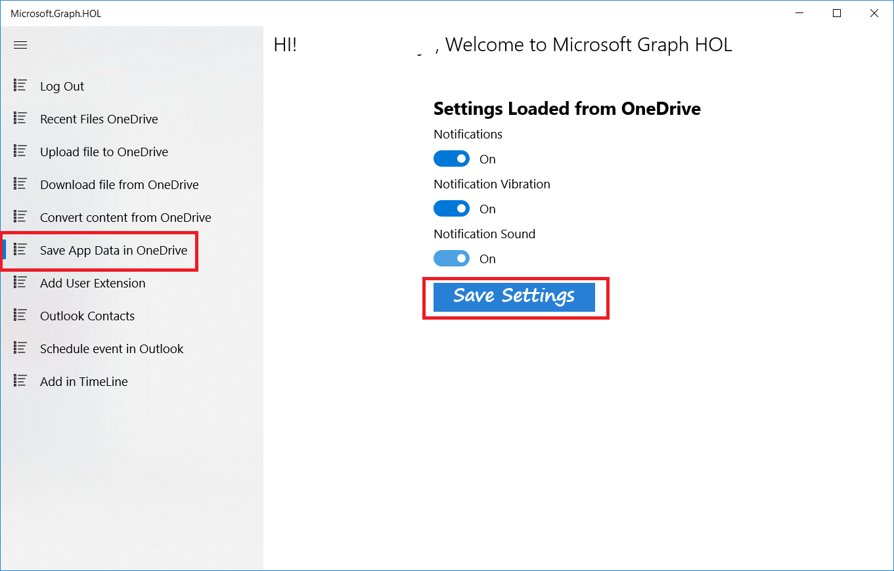

Now that we have learned how to interact with OneDrive, one of the options we have is to save the information of our application (e.g. settings, images, documents, backups) in OneDrive. 

That way, if we install the application in another device we can recover all the information and settings we had.

Specifically in this section we are going to simulate how to save settings in OneDrive and how to recover them after a clean installation.

### Write app settings to OneDrive

In the UWP project go to **Helpers/DataSyncHelper.cs** SaveSettingsInOneDrive method and follow the steps:

- Delete the code

	`throw new NotImplementedException();`

- Add the following code

          	try
            {
                var model = JsonConvert.SerializeObject(settingsModel);
                var graphClient = AuthenticationHelper.GetAuthenticatedClient();
          
                using (var contentStream = GenerateStreamFromString(model))
                {
                    var uploadedItem = await graphClient
                                                 .Drive
                                                 .Root
                                                 .ItemWithPath($"Hol/Graph/Settings/settings.txt")
                                                 .Content
                                                 .Request()
                                                 .PutAsync<DriveItem>(contentStream);
                }
            }
            catch (Exception ex)
            {
                Debug.WriteLine("Error get upload settings file in OneDrive: " + ex.Message);
                throw;
            }

- Build and run the application.

- Click the **Log in** button.

- Select the **Save App Data in OneDrive** option in the menu

- Activate all options

- Click the **Save Setting** button

- Now go to your OneDrive and you can see the file settings.txt was created in **HOL/Graph/Settings**. This file contains the app settings.

### Restore settings when installing the app

Now we need to uninstall our UWP app. Search for Microsoft.Graph.HOL App, right click and uninstall.

Now in the UWP project, go to **Helpers/DataSyncHelper.cs** GetSettingsInOneDrive method and follow these steps:

- Delete the code

	`return new SettingsModel();

- Add the following code

            try
            {                
                var graphClient = AuthenticationHelper.GetAuthenticatedClient();

                var settingsStream = await graphClient
                                                .Drive
                                                .Root
                                                .ItemWithPath($"Hol/Graph/Settings/settings.txt")
                                                .Content
                                                .Request()
                                                .GetAsync();

                var settingsString = DeserializeFromStream(settingsStream);
                return JsonConvert.DeserializeObject<SettingsModel>(settingsString);
            }
            catch(Microsoft.Graph.ServiceException ex)
            {
                if (ex.Error.Code.Equals("itemNotFound"))
                {
                    return new SettingsModel();
                }
                Debug.WriteLine("Error get upload file in OneDrive: " + ex.Message);
                throw;
            }
            catch (Exception ex)
            {
                Debug.WriteLine("Error get upload file in OneDrive: " + ex.Message);
                throw;
            }

- Build and run the application.

- Click the **Log in** button.

- Select the **Save App Data in OneDrive** option from the menu.

- You'll see the options you selected before.
