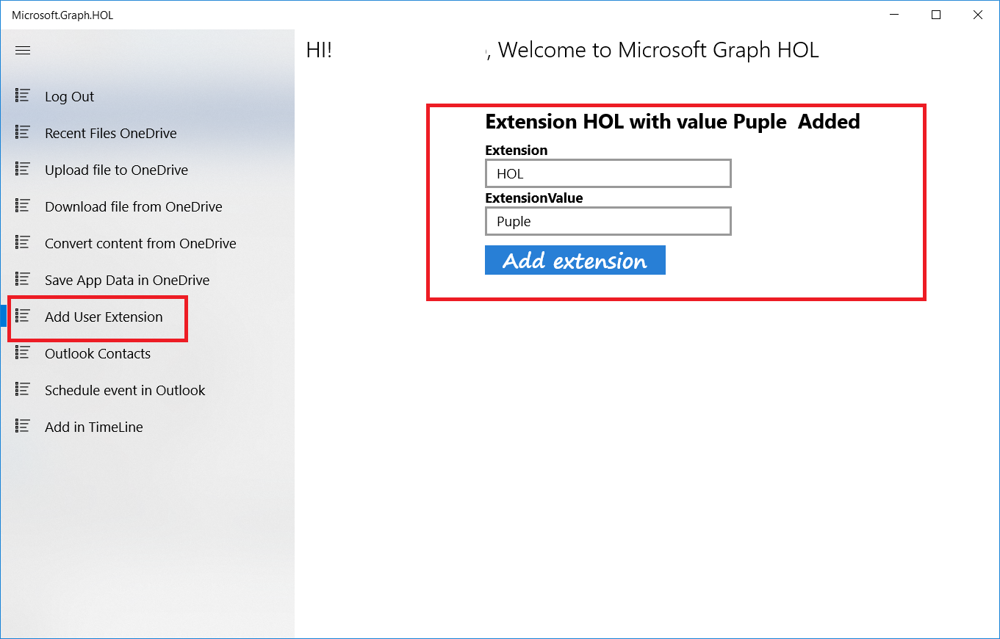

The Microsoft Graph is not a closed tool that gives us a series of classes and functions and nothing else.

One of its strengths is the ability to expand that information with personalized information.

In this section we will see how we can do it.

### Add custom data to resource	

In the UWP project go to **Helpers/UserExtensionHelper.cs** SetExtension method and follow these steps:

- Delete the code

	`throw new NotImplementedException();`

- Add the following code

           try
            {
                var graphClient = AuthenticationHelper.GetAuthenticatedClient();
                var extenion = new OpenTypeExtension
                {
                    ExtensionName = extensionName,
                    AdditionalData = data
                };

                await graphClient.Me.Extensions.Request().AddAsync(extenion);
            }
            catch (Exception ex)
            {
                Debug.WriteLine("Error to set extension in graph: " + ex.Message);
                throw;
            }

- Build and run the application.

- Click the **Log in** button.

- Select the **Add User Extension** option in menu

- Enter a name for the extension and a value

- Click on **Add Extension**.

 

After saving the extension, the app calls to Graph to obtain the extension and its value and set it again.
You can see the following code in **UserExtension.xaml.cs** 

 	
		private async void Button_AddExtension_Click(object sender, RoutedEventArgs e)
        {
            try
            {
                this.Progress.IsActive = true;
                var dictionary = new Dictionary<string, object>();
                dictionary.Add(this.txtExtension.Text, this.txtExtensionValue.Text);
				//Save the extension
                await UserExtensionHelper.SetExtension(this.txtExtension.Text, dictionary);
                InfoText.Text = "Extension Added Correctly.Get Extensions....";
				//GetExtension
                var extensionList = await UserExtensionHelper.GetOpenExtensionsForMe();
                var rmyExtension = extensionList.Where(x => x.Display.Equals(this.txtExtension.Text)).First();
                await UserExtensionHelper.DeleteOpenExtensionForMe(this.txtExtension.Text);
                InfoText.Text = $"Extension {rmyExtension.Display} with value {rmyExtension.Properties[rmyExtension.Display].ToString()}  Added";
            }
            catch (Exception ex)
            {
                InfoText.Text = $"OOPS! An error ocurred: {ex.GetMessage()}";
            }
            finally
            {
                this.Progress.IsActive = false;
            }
        }

The code to call the Microsoft Graph API to get extension are in **Helpers/UserExtensionHelper.cs** GetOpenExtensionsForMe method:

 		public static async Task<List<ExtensionModel>> GetOpenExtensionsForMe()
        {
            try
            {
                var graphClient = AuthenticationHelper.GetAuthenticatedClient();

                var result = await graphClient.Me.Extensions.Request().GetAsync();

                return result.CurrentPage.Select(r => new ExtensionModel()
                {
                    Display = r.Id,
                    Properties = (Dictionary<string, object>)r.AdditionalData
                }).ToList();
            }
            catch (Exception ex)
            {
                Debug.WriteLine("Error to get sextension in graph: " + ex.Message);
                throw;
            }
        }

   
> **Note:** The Maximum number of extensions by applications is two.
