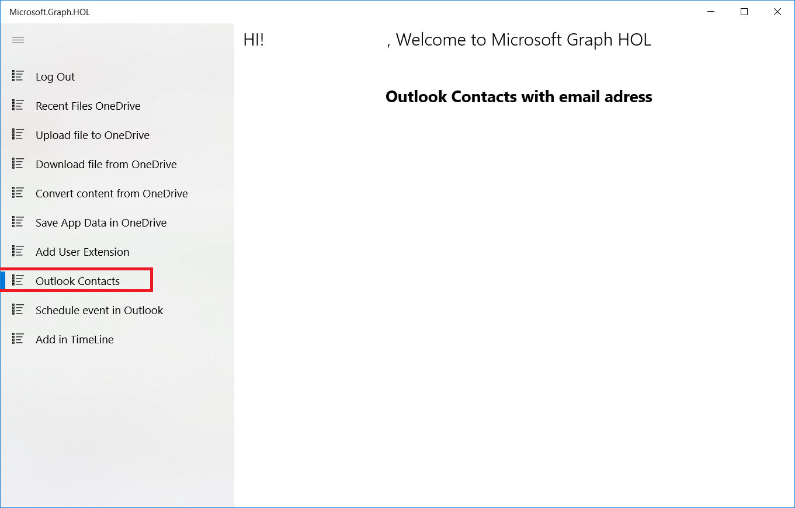
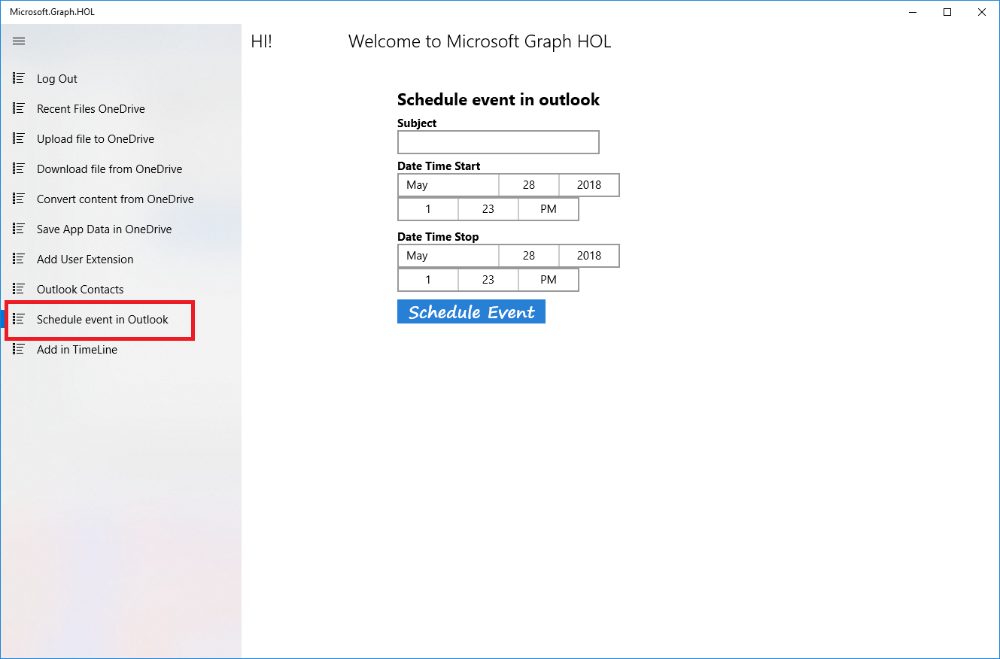

Not only can we integrate with OneDrive, we can also integrate with the entire Office package through the Microsoft Graph API. In this section we will see how we can interact with Outlook to get contacts and to schedule events in the calendar.

### Get personal contacts from Outlook

In the UWP project go to **Helpers/OutlookHelper.cs** GetContacts method and follow these steps:

- Delete this code

	`throw new NotImplementedException();`

- Add the following code

            try
            {
                var graphClient = AuthenticationHelper.GetAuthenticatedClient();
                return await graphClient.Me.Contacts.Request().GetAsync();
            }

            catch (Exception ex)
            {
                Debug.WriteLine("Error get contacts files in OneDrive: " + ex.Message);
                throw;
            }

- Build and run the application.

- Click the Log in button.

- Select the **Outlook Contacts** option in the menu

- You can see the name and email from your Outlook contacts

 

### Create an event in the Outlook calendar 

In the UWP project go to **Helpers/OutlookHelper.cs** SetAppointment method and follow these steps:

- Delete the code

	`throw new NotImplementedException();`

- Add the following code

            try
            {
                var graphClient = AuthenticationHelper.GetAuthenticatedClient();
                var start = new DateTimeTimeZone();
                start.DateTime = startCombo.ToString();
                start.TimeZone = TimeZoneInfo.Local.StandardName;

                var end = new DateTimeTimeZone();
                end.DateTime = endCombo.ToString();
                end.TimeZone = TimeZoneInfo.Local.StandardName;

                var evt = new Event()
                {
                    Subject =subject,
                    Start = start,
                    End = end
                };
                await graphClient.Me.Events.Request().AddAsync(evt);
            }

            catch (Exception ex)
            {
                Debug.WriteLine("Error set appintmen files in OneDrive: " + ex.Message);
                throw;
            }

- Build and run the application.

- Click the **Log in** button.

- Select the **Schedule event in Outlook** option from the menu
.
- Add a subject, select a start date and hour and an end date and hour.

- Click on **Schedule Event**.

 

- If you go to the Outlook calendar, you can see the event.