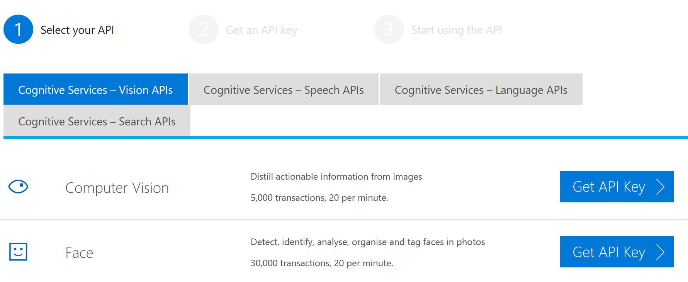
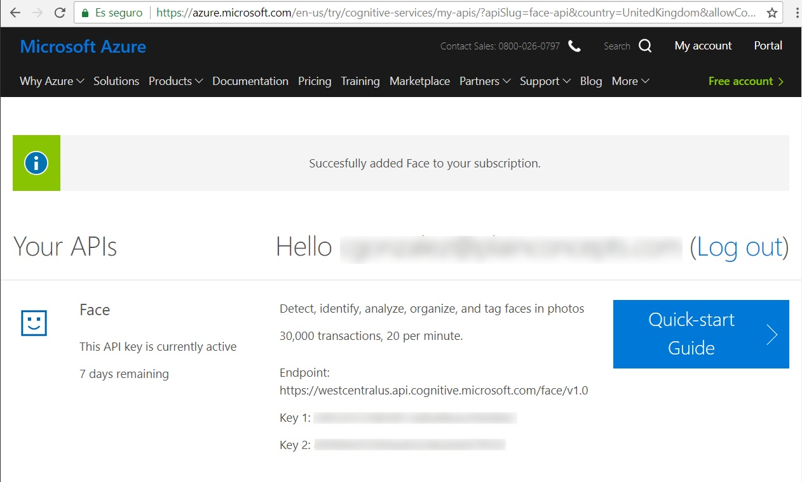

In this section, you'll create an alarm clock application that uses machine learning for emotion detection. The application will ask users to show an emotion for at least 3 seconds to turn off the alarm.

Emotion detection will be implemented in two different ways:

- In the intelligent cloud using the Azure Cognitive Services Face API (this section)
- On the intelligent edge using a local model with Windows ML (next section)

## 1. Create the clock application

Let's start by creating a simple application that displays a clock.

1. Open **Visual Studio**, and go to **File** > **New** > **Project**. Under Visual C#, select Windows Universal Blank App, and name the project AlarmClock.

2. Set the target and minimum versions to Windows 10, version 1903.

3. In the Debug menu, set the platform to x64, since some of the packages you'll be using do not run under x86.

4. In the Solution Explorer, open the `Package.appxmanifest` file, go to Capabilities section, and check the WebCam option.

5. In the Solution Explorer, right click on your **Alarm Clock (Universal Windows)** project, and select **Manage Nuget Packages...**. In the Browse tab, search for and install the following nuget packages:
    - Microsoft.Toolkit.Uwp.UI.Controls (v4.0.0)
    - Microsoft.ProjectOxford.Face (v1.4.0)

6. In Solution Explorer, open `MainPage.xaml`. Add the following namespace to the Page:

    ```xaml
    xmlns:controls="using:Microsoft.Toolkit.Uwp.UI.Controls"
    ```

7. Replace the Grid with the code below. This grid has contains:
    - The webcam preview
    - A message with the emotion required to stop the alarm
    - A message with the currently detected emotion
    - The clock, that will blink and show a little message while the alarm is on
    
    ```xaml
    <Grid Background="Black">
        <Grid.RowDefinitions>
            <RowDefinition Height="*"></RowDefinition>
            <RowDefinition Height="60"></RowDefinition>
            <RowDefinition Height="60"></RowDefinition>
            <RowDefinition Height="250"></RowDefinition>
        </Grid.RowDefinitions>
        <Grid.ColumnDefinitions>
            <ColumnDefinition Width="*"></ColumnDefinition>
            <ColumnDefinition Width="100"></ColumnDefinition>
        </Grid.ColumnDefinitions>
        <controls:CameraPreview Grid.Row="0" Grid.ColumnSpan="2" x:Name="camera" />
        <TextBlock Grid.Row="2" Grid.ColumnSpan="2" x:Name="DetectedEmotion" VerticalAlignment="Center" HorizontalAlignment="Center" Foreground="White" FontSize="30"></TextBlock>
    </Grid>
    ```

8. In `MainPage.xaml.cs`, replace the `using` clauses with the ones below.

    ```csharp
    using Microsoft.ProjectOxford.Face;
    using Microsoft.ProjectOxford.Face.Contract;
    using System;
    using System.Collections.Generic;
    using System.IO;
    using System.Linq;
    using System.Runtime.InteropServices.WindowsRuntime;
    using System.Threading.Tasks;
    using System.Timers;
    using Windows.Graphics.Imaging;
    using Windows.Media;
    using Windows.Media.FaceAnalysis;
    using Windows.Storage;
    using Windows.Storage.Streams;
    using Windows.UI;
    using Windows.UI.Core;
    using Windows.UI.Xaml;
    using Windows.UI.Xaml.Controls;
    using Windows.UI.Xaml.Media;
    using Windows.UI.Xaml.Navigation;
    using Microsoft.Toolkit.Uwp.Helpers;
    ```

## 2. Declare the recognized emotions

In this project, we'll be able to detect 8 different emotions ("Neutral", "Happiness", "Surprise", "Sadness", "Anger", "Disgust", "Fear" and "Contempt").

1. In `MainPage.xaml.cs`, add some global variables:

    ```csharp
    private List<string> labels;
    private string expectedEmotion;
    private string detectedEmotion = string.Empty;
    private VideoFrame lastFrame;
    ```

2. Override the OnNavigatedTo method:

    ```csharp
    protected async override void OnNavigatedTo(NavigationEventArgs e)
    {
        labels = new List<string>()
        {
            "Neutral",
            "Happiness",
            "Surprise",
            "Sadness",
            "Anger",
            "Disgust",
            "Fear",
            "Contempt"
        };
    }
    ```

## 3. Capture frames

Now, let's capture images from the webcam for emotion detection.

1. At the end of the `OnNavigatedTo` method, add:

    ```csharp
    await camera.StartAsync();
    camera.CameraHelper.FrameArrived += Preview_FrameArrived;
    ```

    When a new frame is available, the `CameraPreview.FrameArrived` event triggers, so we can capture the new frame.

2. For now, we'll simply store the last frame captured.

    ```csharp
    private async void Preview_FrameArrived(object sender, FrameEventArgs e)
    {
        lastFrame = e.VideoFrame;
    }
    
    private async Task AnalyzeFrame()
    {
        // Analyze the last frame
        try
        {
            detectedEmotion = await DetectEmotionWithCognitiveServices();
        }
        catch
        {
            return;
        }
    }
    ```

## 4. Detect emotion using Azure Cognitive Services

The Cognitive Services Face API takes in an image and returns the result of the face detection, including the emotion. You can provide the image as a URL or as a Stream. 

In this project, we'll use a Stream. We'll also scale down the image to 200 pixels height, which the API does not require, but it'll speed up the process.

1. Add the code below to scale down your captured frame, and get the emotion detected by Cognitive Services.

    ```csharp
    private async Task<string> DetectEmotionWithCognitiveServices()
    {
        var originalBitmap = lastFrame.SoftwareBitmap;
        if (originalBitmap == null)
            return "No frame captured";
    
        // Set correct subscriptionKey and API Url.
        string subscriptionKey = "YOUR SUBSCRIPTION KEY";
        string apiBaseUrl = "YOUR ENDPOINT HERE";
    
        using (InMemoryRandomAccessStream imageStream = new InMemoryRandomAccessStream())
        {
            SoftwareBitmap bitmap = SoftwareBitmap.Convert(originalBitmap, BitmapPixelFormat.Rgba16);
            BitmapEncoder encoder = await BitmapEncoder.CreateAsync(BitmapEncoder.PngEncoderId, imageStream);
            encoder.SetSoftwareBitmap(bitmap);
            var ratio = bitmap.PixelHeight / 200;
            encoder.BitmapTransform.ScaledHeight = (uint)Math.Round((double)bitmap.PixelHeight / ratio);
            encoder.BitmapTransform.ScaledWidth = (uint)Math.Round((double)bitmap.PixelWidth / ratio);
            await encoder.FlushAsync();
    
            imageStream.Seek(0);
    
            var faceServiceClient = new FaceServiceClient(subscriptionKey, apiBaseUrl);
            var detectedEmotion = string.Empty;
    
            try
            {
                Face[] faces = await faceServiceClient.DetectAsync(imageStream.AsStream(), false, true, new FaceAttributeType[] { FaceAttributeType.Emotion });
                var detectedFace = faces?.FirstOrDefault();
                detectedEmotion = detectedFace == null ? "Nothing" : detectedFace.FaceAttributes.Emotion.ToRankedList().FirstOrDefault().Key;
            }
            catch (FaceAPIException e)
            {
                detectedEmotion = "API error. Check the values of subscriptionKey and apiBaseUrl";
            }
    
            return detectedEmotion;
        }
    }
    ```
    
    You need to provide a valid Subscription Key and API endpoint, but we'll see how to get them on the next section.
  
2. The last step is to make this evaluation happen regularly. In order to avoid issues with the service, we'll limit the API calls to one every 5 seconds.

    At the top of the class, add a new global variable:
    
    ```csharp
    private Timer timer = new Timer(5000);
    ```
    
    At the end of the OnNavigatedTo method, add the following code:
    
    ```csharp
    timer.Elapsed += Timer_Elapsed;
    timer.Start();
    ```
    
    And then add the code to handle the Elapsed event:
    
    ```csharp
    private async void Timer_Elapsed(object sender, ElapsedEventArgs e)
    {
        await AnalyzeFrame();
    
        await Windows.ApplicationModel.Core.CoreApplication.MainView.CoreWindow.Dispatcher.RunAsync(CoreDispatcherPriority.Normal,
        () =>
            {
                DetectedEmotion.Text = string.Format("Detected {0} at {1}", detectedEmotion, DateTime.Now.ToLongTimeString());
            }
        );
    }
    ```
    
    When the timer fires every 10 seconds, the last frame stored will be evaluated, and the DetectedEmotion TextBlock will be updated with the results.

## 5. Get your account key and API url

1. Open a browser window, and go to https://azure.microsoft.com/services/cognitive-services/.

2. Click on "Try Cognitive Services for free", and look for Face API in the next page.

    

3. Click on "Get API Key". Accept the service conditions, and log in with your preferred account.

    

4. Copy any of the displayed keys to your clipboard and paste it in the DetectEmotion method.
    
    ```csharp
    string subscriptionKey = "YOUR SUBSCRIPTION KEY";
    ```
    
5. Copy the API endpoint to your clipboard, and paste it in the DetectEmotion method.

    ```csharp
    string apiBaseUrl = "YOUR ENDPOINT HERE";
    ```

    You can now run the application, and check how DetectedEmotion changes with your expression.