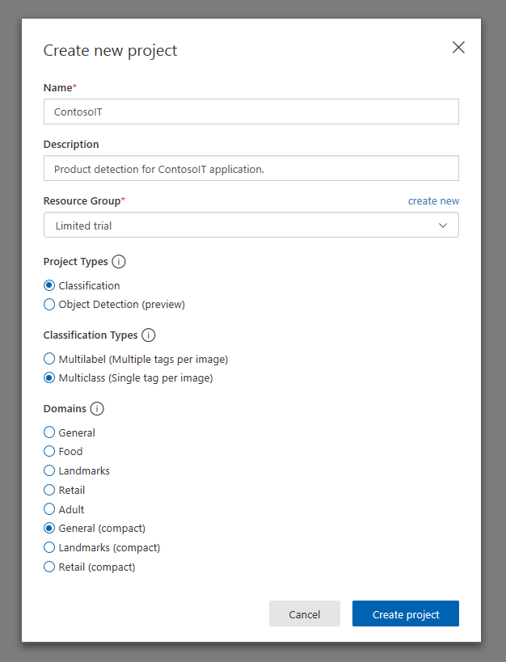
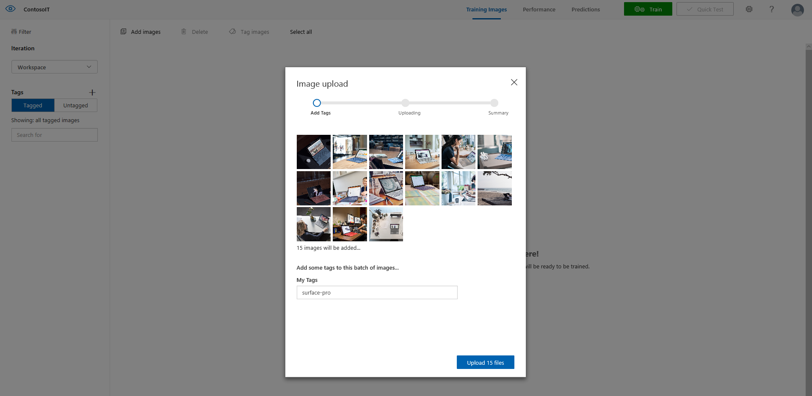
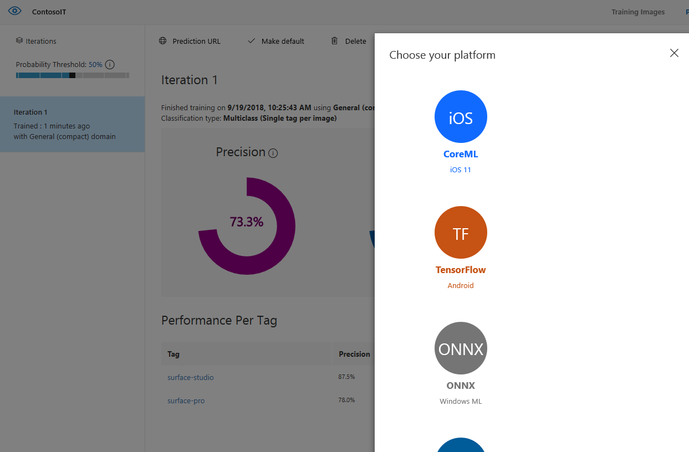

In this section, we'll create an application that detects which product appears in an image or video feed, and displays help information for the detected product.

## 1. Download the example

1. Download the <a href="https://aka.ms/contosogetstarted">ContosoIT</a> UWP application, and uncompress it in a folder of your choice.

    This application allows the user to pick an image of the product from the disk or from the webcam. It includes support for two different products, Surface Pro and Surface Studio.

2. Open the project using **Visual Studio**. If you run the project, note that, no matter which image you pick, it will always detect Surface Pro as the product.

    We'll add intelligence to the application, so it can detect the correct product.

## 2. Create your Custom Vision project

First, we'll create the Custom Vision model we'll use in the ContosoIT application.

1. Open a browser, and go to the <a href="https://customvision.ai/projects">Custom Vision</a> site. Log in with your account, or create one for free if you don't have one.

2. Create a new project with the following settings:
    - **Name**: ContosoIT
    - **Project Types**: Classification
    - **Classification Types**: Multiclass
    - **Domains**: General (compact)
    
    >[NOTE]
    > Make sure you pick "General (compact)" and not "General", so you can later export the model.
    
    

## 3. Train your model

Now, we'll use some images of each product to train the model. The downloaded lab contains a set of images for this purpose.

1. Click on **Add images** on the menu at the top of the page, and then in **Browse local files**.
    
    Go to your ContosoIT application folder, and select all images in \resources\training\surface-pro.
    
    Add a "surface-pro" tag, and upload the files.

    

2. Repeat the process with the images in \resources\training\surface-studio folder, but set the tag as "surface-studio".

3. Click **Train** at the top of the page. The Performance tab will open and show Iteration 1 is in process. Wait until it finishes, and then your model will be ready to test!

## 4. Test the model

1. Click on **Quick test** on the top of the Performance tab.

2. Select the image you want to use from the \resources\prediction\ folder of your ContosoIT application.

    A prediction will appear with the probability of each of the two classes supported by the model.
    
    Note that those classes correspond with the tags you set before.

## 5. Export the model

Now, we can export the model to use in the application.

1. Click export on the Performance tab main menu. Choose ONNX, click Export, and then Download.

    

## 6. Add your model to the ContosoIT application

1. First, rename the downloaded model `ContosoIT.onnx`.

2. In your project in Visual Studio, ensure the selected platform of your UWP application is x64.

3. Drag and drop the `ContosoIT.onnx` file to the **Assets** folder in Solution Explorer.

You'll notice Visual Studio automatically generates a new `ContosoIT.cs` file with the necessary code to create and evaluate the model.

4. Right click the `ContosoIT.onnx` file in Solution Explorer, and select **Properties**. Set **Build Action** to "Content" and **Copy to Output Directory** to "Copy if newer"

5. Review the `ContosoIT.cs` code and replace the generated GUIDs with "ContosoIT". Your file should now contain the ContosoITInput, ContosoITOutput, and ContosoITModel classes.

## 7. Run the model from your application

Finally, we'll edit the **Devices** page to use the Custom Vision model.

1. Open `Pages/DevicesPage.xaml.cs`, and add the following using clause at the top of the file.

    ```csharp
    using Windows.Storage.Streams;
    ```

2. Add a global variable to contain the model.

    ```csharp
    private ContosoIT.ContosoITModel model;
    ```

3. Add a method to initialize the model. Note the path of your onnx file is used during model creation.

    ```csharp
    private async Task InitializeModel()
    {
        string modelPath = @"ms-appx:///Assets/ContosoIT.onnx";
        StorageFile modelFile = await StorageFile.GetFileFromApplicationUriAsync(new Uri(modelPath));
        model = await ContosoIT.ContosoITModel.CreateFromStreamAsync(modelFile);
    }
    ```

4. Call the method InitializeModel from the OnNavigatedTo event handler, before the BeginDetection call.

    ```csharp
    protected override async void OnNavigatedTo(NavigationEventArgs e)
    {
        base.OnNavigatedTo(e);

        await InitializeModel();

        var selectedFile = (DetectionDataParametersModel)e.Parameter;
        await BeginDetection(selectedFile);
    }
    ```

5. Since the model expects a VideoFrame as input, we need add the following method:

    ```csharp
    private async Task<VideoFrame> ImageToVideoframe(StorageFile imageFile)
    {
        using (IRandomAccessStream imageStream = await imageFile.OpenAsync(FileAccessMode.Read))
        {
            // Create the decoder from the stream
            BitmapDecoder decoder = await BitmapDecoder.CreateAsync(imageStream);

            // Get the SoftwareBitmap representation of the file
            SoftwareBitmap softwareBitmap = await decoder.GetSoftwareBitmapAsync();

            VideoFrame imageFrame = VideoFrame.CreateWithSoftwareBitmap(softwareBitmap);

            return imageFrame;
        }
    }
    ```

6. Finally, we can tell the application to use machine learning! Look for the comment that says "Your code goes here", and replace the following line:

    ```csharp
    var classLabel = "surface-pro";
    ```

    With these ones:

    ```csharp
    var videoFrame = await ImageToVideoframe(detectionDataParameters.SelectedFile);
    ContosoITInput modelInput = new ContosoITInput() { data = ImageFeatureValue.CreateFromVideoFrame(videoFrame)};
    ContosoITOutput modelResult = await model.EvaluateAsync(modelInput);
    var classLabel = modelResult.classLabel.GetAsVectorView().FirstOrDefault();
    ```

    Now, the detected product is no longer fixed to "surface-pro." Instead, it shows the result of the evaluation of the trained Custom Vision classification model.
    
    Use the test images you used before on the Custom Vision web, and check the results!

## 8. What's next

That's it, you have finished the Lab! For more information about Microsoft's Machine Learning services and APIs, continue to the next page.
