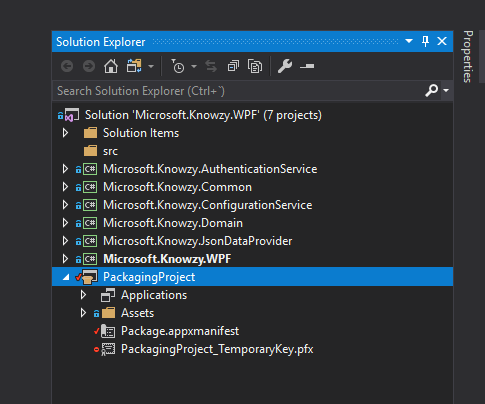
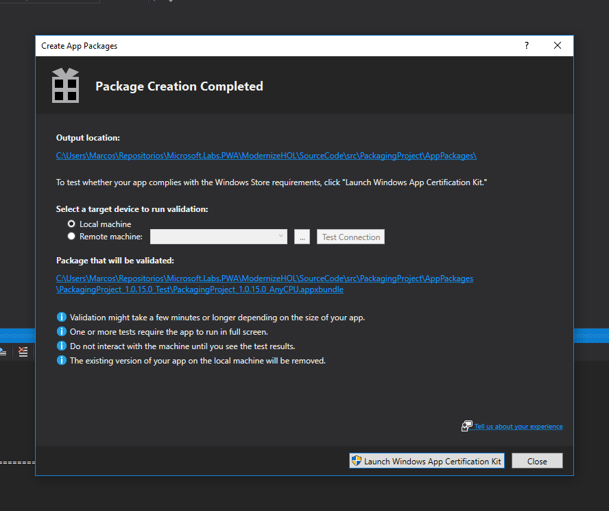

In this section we’ll learn how our WPF app can be packaged using a modern packaging system. A modern packaging system is more secure, reliable, and simple to both create and distribute packages.

Universal Windows Platform (UWP) apps have had this modern packaging ability since inception, and it is now easier than ever to use these same capabilities for your desktop apps. 

To do this, we will use a new open-source packaging system called MSIX, which you can start experimenting with on GitHub: <a href="https://github.com/Microsoft/msix-packaging" target="_blank">MSIX Packaging SDK</a>

To start on this journey, you can use the Visual Studio Application Packaging project template, which is what you will now go ahead and configure.

### Packaging our WPF app for side-loading

1.  **Right-click** on the solution -> **Add** -> **New Project...** -> **Windows Application Packaging (Visual C\#)** template (located under **Visual C\#** -> **Windows Universal**). This new project will generate packages for us which can be both uploaded to the Store or side-loaded. Give your project a name (e.g. "KnowzyPackagingProject") in the default location and select **OK**.

2. You will be prompted to select a **Target version** and **Minimum version** of the platform. For now, stick to the defaults and hit **OK**.

3. **Right-click** on the new project's **Applications** node -> **Add Reference...** and check **Microsoft.Knowzy.WPF** -> **OK**

Now our package will automatically contain our WPF app.

You can customize the app name, its icons and a few more options at Package.appxmanifest file, but we’ll stick with predefined values for now.

In order to generate the package, **right click** on **PackagingProject** and choose **Store** -> **Create App Packages**. This will open a new wizard which will guide you through the process.

4.  Choose **I want to create packages for sideloading**. You should see that the **Enable automatic updates** option is currently disabled - you will come back to this later. Hit **Next**.

5.  We can customize the output location, version and architectures, among other options, but leave these at the default for now and select **Create**.

6.  Once the process ends, a new dialog will link us to the path where the package was created - click on the link to your packages folder and open the folder for your newly created package.

    

**Note:** Your package is currently bundled with a developer/test certificate, which you will need to replace before you deploy to production. For now you can trust this developer certificate on your machine, which will enable you to do a test install (remember to remove this later).

7. **Double-click** the **.cer** file -> **Install Certificate** -> **Local Machine** -> **Next** -> **Place all certificates in the following store** -> **Browse** -> **Trusted Root Certification Authorities** -> **OK** -> **Next** -> **Finish** -> **Yes** -> **OK**.

8. **Double click** on the **.appxbundle** file and the new setup process will start, install your app locally and add it to the Start menu, as if it was done through the Store. Hit the **Install** button and follow the steps to **Launch**. Once you have finished testing, uninstall the app.

### Enabling automatic updates

You will now enable a new feature of **Windows 10** - automatic updates. To get started, you will need to target the latest Windows 10 SDK.

9.  We need to target one of the most recent builds of the Windows 10 SDK to be able to configure the automatic updates. **Right-click** on the packaging project -> **Properties** -> **Package** tab. Within **Targeting** area, change **Min version** to “**Windows 10, version 1903 (10.0; Build 18362)**” and save.

10.  As you'll remember in **step 4**, we unchecked the option '*Enable automatic updates*' on the packaging wizard. Now repeat the process but checking this option. This time a new step is shown asking where the updates will live, letting us choose between a network resource path or a web URL. For the sake of simplification we’ll choose a network path.

**Note:** if you do not see this option, please ensure you are using **Visual Studio 2017 Preview 15.7.2** or higher. (The current version is Visual Studio 2019 16.1.)

11.  In order to serve a local path to the local network first we create a new empty folder on the Desktop (call it **Packages**). **Right click** on the Desktop -> **Properties** -> **Sharing** tab -> **Advanced Sharing**. Check **Share this folder** -> **OK**. If you open a new **Windows Explorer** window and type **\\\\MyLocalMachine\\** at the address bar, you’ll notice your shared folder is now available. Right now we only have read access to the share, but you can write to it through the folder on your filesystem for now.

**Note:** "MyLocalMachine" here is your local machine name - please use this name rather than "localhost".

12.  Within the wizard, paste the folder path of the previous step into **Installation URL** (i.e. “\\\\MyLocalMachine\\Packages”) and leave **Check everytime the application runs** selected (this way the app will check for updates at the specified URL upon start, managing the updating process for us).

13.  Finally click on **Create** and wait for the process to end. A window will appear with the summary of the process. Click on the **Output** location and copy every file and folder into your shared folder on the Desktop.

14. Now open up your share folder (e.g. **\\\\MyLocalMachine\\Packages**) and  **double click** on **index.html**. You will see a similar experience to the one the Store provides. By clicking on **Get the app** will launch the set-up as before, but now the app will look for updates everytime it's launched.

15. Finally, try making a change to your app and create another new package (e.g. version 2.0.0.0). Copy the new package assets (**.html**, ***.appinstaller**, **package folder**) into the folder on your Desktop. Rather than opening the **index.html** file, open your app from the start menu (it will be called something like "KnowzyPackagingProject"). Notice how on start-up the app automatically updates itself.
