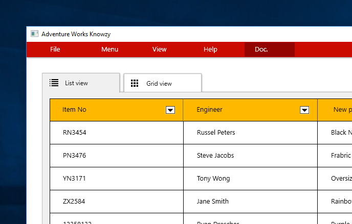
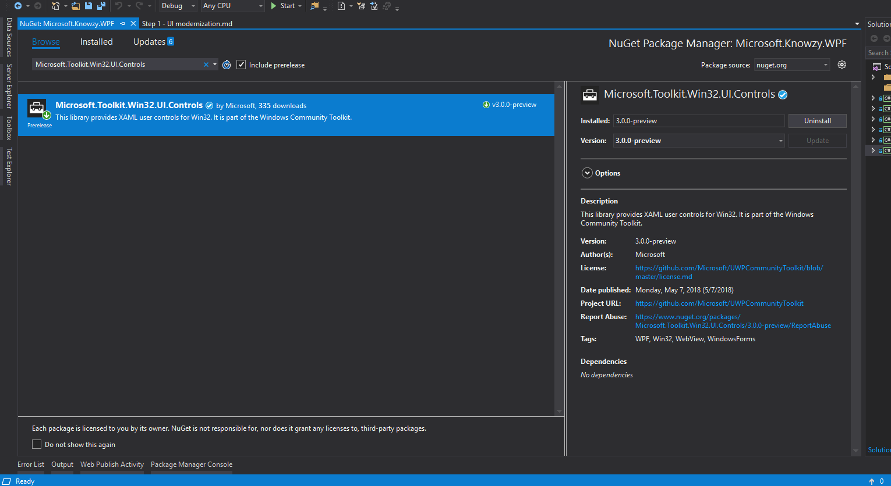

In WPF and WinForms apps today, it is common to have islands of web content that are often hosted in the **WebBrowser** control. The **WebBrowser** control that ships as part of the platform uses the Internet Explorer 11 (IE11) rendering engine, which **does not** support the latest web standards. It is common for apps leveraging this control to observe incorrect rendering of more modern websites. In many cases, it is not possible for the web developer to fix these rendering issues as the website is owned either by a third-party, or a team in another part of the organization.

The following steps will explain how you can switch out the **WebBrowser** control with the modern **WebView** control for WPF and WinForms. This is made possible through the new XAML islands architecture, which extends UWP controls into multiple UI frameworks. You can now have your web content support features such as WebRTC, service workers and more.

To get started, open the solution file (**Microsoft.Knowzy.WPF**) that you downloaded and navigate to the **Microsoft.Knowzy.WPF** project.  This typical-looking business application is built with the Model-View-ViewModel (MVVM) pattern. **Note:** remember to restore Nuget packages for the project (right click your Solution -> Restore NuGet Packages).

### WPF WebBrowser control

1. **Right click** on the **Views** folder in the **Microsoft.Knowzy.WPF** project, and select **Add** -> **Window**. Name your window **DocumentationView.xaml**. Open the file and add the following child control:

~~~~~~~~~~~~~~~~~~~~~~~~~~~~~~~~~~~~~~~~~~~~~~~~~~~~~~~~~~~~~~~~~~~~~~~~~~~~~~~~
<WebBrowser x:Name="webBrowser" />
~~~~~~~~~~~~~~~~~~~~~~~~~~~~~~~~~~~~~~~~~~~~~~~~~~~~~~~~~~~~~~~~~~~~~~~~~~~~~~~~

2. Now open the code-behind file (**DocumentationView.xaml.cs**), and add the following event handler code:

~~~~~~~~~~~~~~~~~~~~~~~~~~~~~~~~~~~~~~~~~~~~~~~~~~~~~~~~~~~~~~~~~~~~~~~~~~~~~~~~
public DocumentationView()
{
    InitializeComponent();

    DataContextChanged += DocumentationView_DataContextChanged;
}

private void DocumentationView_DataContextChanged(object sender, DependencyPropertyChangedEventArgs e)
{
    if (e.NewValue != null && e.NewValue is DocumentationViewModel viewModel)
    {
        webBrowser.Navigate(viewModel.URL);
    }
}
~~~~~~~~~~~~~~~~~~~~~~~~~~~~~~~~~~~~~~~~~~~~~~~~~~~~~~~~~~~~~~~~~~~~~~~~~~~~~~~~

3. This code is listening for when the view's data context (view model) changes, and then navigating the **WebBrowser** control to the new **URL** on the view model.

4. From the code, you can see that there is a **DocumentationViewModel** class is expected. To create this class, **right-click** on the **ViewModels** folder -> **Add** -> **Class**. Name your class **DocumentationViewModel.cs**.

5. For now, you will keep your class simple and just add a single property to store your navigation URL:

~~~~~~~~~~~~~~~~~~~~~~~~~~~~~~~~~~~~~~~~~~~~~~~~~~~~~~~~~~~~~~~~~~~~~~~~~~~~~~~~
public class DocumentationViewModel : Caliburn.Micro.Screen
{
    public string URL => "http://aboutknowzy.azurewebsites.net?view=docs";
}
~~~~~~~~~~~~~~~~~~~~~~~~~~~~~~~~~~~~~~~~~~~~~~~~~~~~~~~~~~~~~~~~~~~~~~~~~~~~~~~~

**Note:** Your class should inherit from **Caliburn.Micro.Screen**. Caliburn is a UI framework that helps implement the MVVM pattern. You will also need to add a namespace reference to your new view model class in **Documentation.xaml.cs**.

6. Next find your **AppBootstrapper.cs** file (in the root of your **Microsoft.Knowzy.WPF** project), and add the new ViewModel so can be injected along with the View:

~~~~~~~~~~~~~~~~~~~~~~~~~~~~~~~~~~~~~~~~~~~~~~~~~~~~~~~~~~~~~~~~~~~~~~~~~~~~~~~~
protected override void Configure()
{
    var builder = new ContainerBuilder();
    [...]
    builder.RegisterType<DocumentationViewModel>().SingleInstance();
~~~~~~~~~~~~~~~~~~~~~~~~~~~~~~~~~~~~~~~~~~~~~~~~~~~~~~~~~~~~~~~~~~~~~~~~~~~~~~~~

7. Next you will add a new button to the menu bar in your UI.  Open **Views\MainView.xaml** and locate the **MenuItem** whose **cal:Message.Attach** property is equal to **About()**. It looks something like this:

~~~~~~~~~~~~~~~~~~~~~~~~~~~~~~~~~~~~~~~~~~~~~~~~~~~~~~~~~~~~~~~~~~~~~~~~~~~~~~~~
<MenuItem Header="{x:Static localization:Resources.Help_Menu}" Template="{DynamicResource MenuItemControlTemplate}"
                      cal:Message.Attach="About()" />
~~~~~~~~~~~~~~~~~~~~~~~~~~~~~~~~~~~~~~~~~~~~~~~~~~~~~~~~~~~~~~~~~~~~~~~~~~~~~~~~

8. Directly below this code, add the following:

~~~~~~~~~~~~~~~~~~~~~~~~~~~~~~~~~~~~~~~~~~~~~~~~~~~~~~~~~~~~~~~~~~~~~~~~~~~~~~~~
<MenuItem Header="Doc." Template="{DynamicResource MenuItemControlTemplate}"
                          cal:Message.Attach="Documentation()" />
~~~~~~~~~~~~~~~~~~~~~~~~~~~~~~~~~~~~~~~~~~~~~~~~~~~~~~~~~~~~~~~~~~~~~~~~~~~~~~~~

9. You have now added a **MenuItem** that when selected will look for your new **Documentation** view. You now need to wire up the other end of this in the view model. Open **MainViewModel.cs** and add the following method:

~~~~~~~~~~~~~~~~~~~~~~~~~~~~~~~~~~~~~~~~~~~~~~~~~~~~~~~~~~~~~~~~~~~~~~~~~~~~~~~~
public void Documentation()
{
    _eventAggregator.PublishOnUIThread(new OpenDocumentationMessage());
}
~~~~~~~~~~~~~~~~~~~~~~~~~~~~~~~~~~~~~~~~~~~~~~~~~~~~~~~~~~~~~~~~~~~~~~~~~~~~~~~~

10. **OpenDocumentationMessage** is a new **class** that needs to be created in the Messages folder. Create the class (ensuring it is marked **public**) and just leave it with the standard boilerplate code.

11. Finally, open **ShellViewModel.cs**. Here you will need to inherit **ShellViewModel** from a new generic interface called **IHandle<OpenDocumentationMessage>**, followed by a new **readonly field** which stores the DocumentationViewModel
instance - and its corresponding **Handle() method**. Add the code below to your **ShellViewModel.cs** file.

~~~~~~~~~~~~~~~~~~~~~~~~~~~~~~~~~~~~~~~~~~~~~~~~~~~~~~~~~~~~~~~~~~~~~~~~~~~~~~~~
public class ShellViewModel : [...], IHandle<OpenDocumentationMessage>
{
    [...]
    private readonly DocumentationViewModel _documentationViewModel;

    public ShellViewModel([...], DocumentationViewModel documentationViewModel)
    {
        [...]
        _documentationViewModel = documentationViewModel;
    }

    [...]

    public void Handle(OpenDocumentationMessage message)
    {
        _windowManager.ShowDialog(_documentationViewModel);
    }
~~~~~~~~~~~~~~~~~~~~~~~~~~~~~~~~~~~~~~~~~~~~~~~~~~~~~~~~~~~~~~~~~~~~~~~~~~~~~~~~

12. Build and run the solution to test the code above by selecting the **Documentation** menu option.

**NOTE:** You should see that the your new DocumentationView opens in a new window and renders the URL specified within DocumentationViewModel. There is a problem here though - the web page uses CSS3 styles that the **WebBrowser** control does not understand - this is just one simple example. You will now go through steps to resolve this by replacing the **WebBrowser** control with the modern **WebView**.

## Replacing WebBrowser with WebView

In order to make the WebView available from WPF (or WinForms), add the NuGet package
<a href="https://www.nuget.org/packages/Microsoft.Toolkit.Win32.UI.Controls/" target="_blank">Microsoft.Toolkit.Win32.UI.Controls</a>
to your **Microsoft.Knowzy.WPF** project. 

**Note:** You will need to ensure your project is targeting **.NET Framework 4.6.2** before you continue.

1. **Right click** your **Microsoft.Knowzy.WPF** project -> **Properties** -> set **Target framework** to **.NET Framework 4.6.2**. If you don't see the option for that version of the framework, then open the **Visual Studio Installer** from your start menu, and install it from there.

2. Now **right click** on your **Microsoft.Knowzy.WPF** project -> **Manage NuGet Packages...** -> **Browse** -> **Microsoft.Toolkit.Win32.UI.Controls** -> select -> **Install**.

3. Open **Views/DocumentationView.xaml** and add a new namespace reference for the NuGet package you added:

~~~~~~~~~~~~~~~~~~~~~~~~~~~~~~~~~~~~~~~~~~~~~~~~~~~~~~~~~~~~~~~~~~~~~~~~~~~~~~~~
<Window x:Class="Microsoft.Knowzy.WPF.Views.DocumentationView"
        [...]
        xmlns:toolkitControls="clr-namespace:Microsoft.Toolkit.Win32.UI.Controls.WPF;assembly=Microsoft.Toolkit.Win32.UI.Controls"
        mc:Ignorable="d"
        Title="DocumentationView" Height="450" Width="800">
~~~~~~~~~~~~~~~~~~~~~~~~~~~~~~~~~~~~~~~~~~~~~~~~~~~~~~~~~~~~~~~~~~~~~~~~~~~~~~~~

4. Now all that's left to do is replace your **WebBrowser** control with your **toolkitControls:WebView** control like so:

~~~~~~~~~~~~~~~~~~~~~~~~~~~~~~~~~~~~~~~~~~~~~~~~~~~~~~~~~~~~~~~~~~~~~~~~~~~~~~~~
        <toolkitControls:WebView x:Name="webBrowser" />
        <!--<WebBrowser x:Name="webBrowser" />-->
~~~~~~~~~~~~~~~~~~~~~~~~~~~~~~~~~~~~~~~~~~~~~~~~~~~~~~~~~~~~~~~~~~~~~~~~~~~~~~~~

5. That's it! Re-run your app and test the new web view - you should now see the content renders correctly in the centre of your **DocumentationView**.
