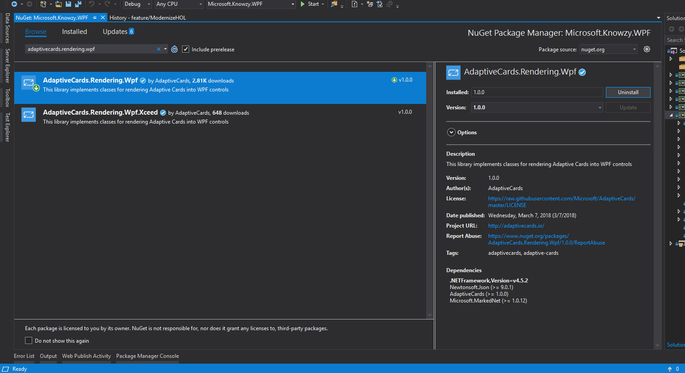
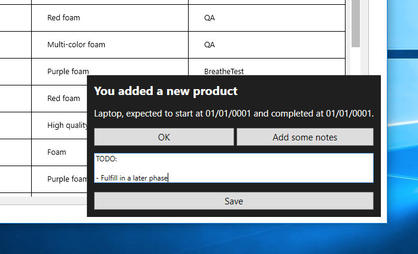

<a href="https://adaptivecards.io/" target="_blank">Adaptive Cards</a> are a new way for developers to exchange card content in a common and consistent way. For example, maybe you work for a shipping company and you want the user to be notified when a product moves from the order stage to the shipping stage - you can build a single Adaptive Card that represents that information and it renders as appropriate on the target experience (UWP, WPF, iOS, Android, Web, etc.).

**Note:** You can start playing with samples quickly online <a href="https://adaptivecards.io/samples/" target="_blank">here</a>.

You will start by adding Adaptive Cards support to your WPF app.

### Adding support for Adaptive Cards to WPF

Microsoft provides multiple SDKs to extend Adaptive Cards support into multiple UI frameworks. For WPF you can access this feature through the <a href="https://www.nuget.org/packages/AdaptiveCards.Rendering.Wpf/" target="_blank">AdaptiveCards.Rendering.Wpf</a> NuGet package.

1. **Right-click** your **Microsoft.Knowzy.WPF** project references and choose **Manage NuGet Packages...** -> search for **AdaptiveCards.Rendering.Wpf** and install the package.

### Creating your card

In this scenario you will show a card once a new production line product is manufactured. You will also make this an actionable card so you can easily add updates to the product at a given stage.

1. You will be rendering your car inside of the **MainView.xaml** view. Start by adding a container to render the card inside of this view like so (this is right at the bottom of the file):

~~~~~~~~~~~~~~~~~~~~~~~~~~~~~~~~~~~~~~~~~~~~~~~~~~~~~~~~~~~~~~~~~~~~~~~~~~~~~~~~
    [...]

        <Grid
            x:Name="adaptiveCardContainer"
            HorizontalAlignment="Right"
            VerticalAlignment="Bottom"
            Grid.Row="1"
            Margin="10"/>

    </Grid>
</UserControl>
~~~~~~~~~~~~~~~~~~~~~~~~~~~~~~~~~~~~~~~~~~~~~~~~~~~~~~~~~~~~~~~~~~~~~~~~~~~~~~~~

You have given your container a name of **adaptiveCardContainer** so you can easily access it from code later.

**Note:** You can utilize tools for visualizing your cards for different UI frameworks - there is an <a href="http://adaptivecards.io/visualizer/index.html?hostApp=Bot%20Framework%20WebChat" target="_blank">on-line version</a>
and a <a href="https://github.com/Microsoft/AdaptiveCards/tree/master/source/dotnet/Samples/WPFVisualizer" target="_blank">WPF-based one</a>. Cards utilize a JSON format, but can also be created in C#.

2. Open **MainView.xaml.cs** and add these namespaces:

~~~~~~~~~~~~~~~~~~~~~~~~~~~~~~~~~~~~~~~~~~~~~~~~~~~~~~~~~~~~~~~~~~~~~~~~~~~~~~~~
using AdaptiveCards;
using AdaptiveCards.Rendering;
using AdaptiveCards.Rendering.Wpf;
using System.IO;
using Microsoft.Knowzy.WPF.Helpers;
~~~~~~~~~~~~~~~~~~~~~~~~~~~~~~~~~~~~~~~~~~~~~~~~~~~~~~~~~~~~~~~~~~~~~~~~~~~~~~~~

3. Next add the following method to return an AdaptiveCard object that you will render inside of the container.

~~~~~~~~~~~~~~~~~~~~~~~~~~~~~~~~~~~~~~~~~~~~~~~~~~~~~~~~~~~~~~~~~~~~~~~~~~~~~~~~
private AdaptiveCard CreateCard()
{
    _cardTitleTextBlock = new AdaptiveTextBlock { Wrap = true };

    var card = new AdaptiveCard
    {
        Body =
        {
            new AdaptiveTextBlock("You added a new product")
            {
                Size = AdaptiveTextSize.Medium,
                Weight = AdaptiveTextWeight.Bolder
            },
            _cardTitleTextBlock
        },
        Actions =
        {
            new AdaptiveSubmitAction { Id = "Ok", Title = "OK" },
            new AdaptiveShowCardAction
            {
                Title = "Add some notes",
                Card = new AdaptiveCard
                {
                    Body =
                    {
                        new AdaptiveTextInput
                        {
                            Id = "Notes",
                            IsMultiline = true,
                            Placeholder = "Type here"
                        }
                    },
                    Actions = { new AdaptiveSubmitAction { Title = "Save" } }
                }
            }
        }
    };

    return card;
}
~~~~~~~~~~~~~~~~~~~~~~~~~~~~~~~~~~~~~~~~~~~~~~~~~~~~~~~~~~~~~~~~~~~~~~~~~~~~~~~~

4. You now need to add some private member variables for referencing the card instance you will create, and initialize them in your constructure. Add the code below as appropriate:

~~~~~~~~~~~~~~~~~~~~~~~~~~~~~~~~~~~~~~~~~~~~~~~~~~~~~~~~~~~~~~~~~~~~~~~~~~~~~~~~
public partial class MainView
{
    private readonly AdaptiveCardRenderer _renderer;
    private readonly AdaptiveCard _card;

    private AdaptiveTextBlock _cardTitleTextBlock;

    public MainView()
    {
        [...]

        InitializeComponent();

        var fileHelper = new FileHelper();
        var json = fileHelper.ReadTextFile("Assets/WindowsNotificationHostConfig.json");
        var hostConfig = AdaptiveHostConfig.FromJson(json);
        _renderer = new AdaptiveCardRenderer(hostConfig);
        _card = CreateCard();
    }
~~~~~~~~~~~~~~~~~~~~~~~~~~~~~~~~~~~~~~~~~~~~~~~~~~~~~~~~~~~~~~~~~~~~~~~~~~~~~~~~

5. Here you will be creating a card that represents an in-app toast notification, so you will follow a similar style to the system-wide toast notifications. As Adaptive Cards are represented in JSON, add a new JSON file name **WindowsNotificationHostConfig.json** to your **Assets** folder. Copy in the content below, and then set your file build settings to **Content** and **Copy if newer**.

~~~~~~~~~~~~~~~~~~~~~~~~~~~~~~~~~~~~~~~~~~~~~~~~~~~~~~~~~~~~~~~~~~~~~~~~~~~~~~~~
{
  "actions": {
    "actionAlignment": "stretch",
    "buttonSpacing": 4,
    "maxActions": 5,
    "showCard": {
      "inlineTopMargin": 12
    }
  },
  "adaptiveCard": {},
  "containerStyles": {
    "default": {
      "backgroundColor": "#FF1F1F1F",
      "foregroundColors": {
        "default": {
          "default": "#FFFFFFFF",
          "subtle": "#99FFFFFF"
        },
        "accent": {
          "default": "#FF419FFE",
          "subtle": "#99419FFE"
        },
        "dark": {
          "default": "#FF000000",
          "subtle": "#99000000"
        },
        "light": {
          "default": "#FFFFFFFF",
          "subtle": "#99FFFFFF"
        },
        "good": {
          "default": "#FF79AB3C",
          "subtle": "#9979AB3C"
        },
        "warning": {
          "default": "#FFFFF000",
          "subtle": "#99FFF000"
        },
        "attention": {
          "default": "#FFE81123",
          "subtle": "#99E81123"
        }
      }
    },
    "emphasis": {
      "backgroundColor": "#FF2E2E2E",
      "foregroundColors": {
        "default": {
          "default": "#FFFFFFFF",
          "subtle": "#99FFFFFF"
        },
        "accent": {
          "default": "#FF419FFE",
          "subtle": "#99419FFE"
        },
        "dark": {
          "default": "#FF000000",
          "subtle": "#99000000"
        },
        "light": {
          "default": "#FFFFFFFF",
          "subtle": "#99FFFFFF"
        },
        "good": {
          "default": "#FF79AB3C",
          "subtle": "#9979AB3C"
        },
        "warning": {
          "default": "#FFFFF000",
          "subtle": "#99FFF000"
        },
        "attention": {
          "default": "#FFE81123",
          "subtle": "#99E81123"
        }
      }
    }
  },
  "imageSizes": {
    "small": 32,
    "medium": 50,
    "large": 150
  },
  "imageSet": {
    "imageSize": "medium"
  },
  "factSet": {
    "title": {
      "weight": "bolder",
      "wrap": true,
      "maxWidth": 150
    },
    "value": {
      "wrap": true
    },
    "spacing": 10
  },
  "fontFamily": "Segoe UI",
  "fontSizes": {
    "small": 12,
    "default": 15,
    "medium": 20,
    "large": 24,
    "extraLarge": 34
  },
  "fontWeights": {
    "lighter": 400,
    "default": 500,
    "bolder": 700
  },
  "spacing": {
    "small": 8,
    "default": 15,
    "medium": 20,
    "large": 24,
    "extraLarge": 34,
    "padding": 12
  },
  "separator": {
    "lineThickness": 1,
    "lineColor": "#66FFFFFF"
  },
  "supportsInteractivity": true
}
~~~~~~~~~~~~~~~~~~~~~~~~~~~~~~~~~~~~~~~~~~~~~~~~~~~~~~~~~~~~~~~~~~~~~~~~~~~~~~~~

**Note:** This file was generated with the <a href="https://github.com/Microsoft/AdaptiveCards/tree/master/source/dotnet/Samples/WPFVisualizer" target="_blank">WPF Visualizer</a>
tool, which also bundles different styles to experiment with. You will now take this item and render it within your app.

### Showing your card

1. Given this app uses an MVVM architecture, product creation logic (for your shipping items) will sit inside of your view model code. Open **MainViewModel.cs** and add a new **ShowAdaptiveCard** property:

~~~~~~~~~~~~~~~~~~~~~~~~~~~~~~~~~~~~~~~~~~~~~~~~~~~~~~~~~~~~~~~~~~~~~~~~~~~~~~~~
private bool _showAdaptiveCard;

public bool ShowAdaptiveCard
{
    get => _showAdaptiveCard;
    set
    {
        _showAdaptiveCard = value;
        NotifyOfPropertyChange(() => ShowAdaptiveCard);
    }
}
~~~~~~~~~~~~~~~~~~~~~~~~~~~~~~~~~~~~~~~~~~~~~~~~~~~~~~~~~~~~~~~~~~~~~~~~~~~~~~~~

2. Now locate the existing **NewItem** method and set your **ShowAdaptiveCard** property to true.

~~~~~~~~~~~~~~~~~~~~~~~~~~~~~~~~~~~~~~~~~~~~~~~~~~~~~~~~~~~~~~~~~~~~~~~~~~~~~~~~
public void NewItem()
{
    var item = new ItemViewModel(_eventAggregator);
    _eventAggregator.PublishOnUIThread(new EditItemMessage(item));

    if (item.Id == null) return;
    DevelopmentItems.Add(item);

    ShowAdaptiveCard = true;
}
~~~~~~~~~~~~~~~~~~~~~~~~~~~~~~~~~~~~~~~~~~~~~~~~~~~~~~~~~~~~~~~~~~~~~~~~~~~~~~~~

3. Open your **MainView.xaml** view and bind the **Visibility** of your container to the property you just created:

~~~~~~~~~~~~~~~~~~~~~~~~~~~~~~~~~~~~~~~~~~~~~~~~~~~~~~~~~~~~~~~~~~~~~~~~~~~~~~~~
    [...]

        <Grid
            x:Name="adaptiveCardContainer"
            [...]
            Visibility="{Binding ShowAdaptiveCard, Converter={StaticResource BoolToVisibilityConverter}}"/>

    </Grid>
</UserControl>
~~~~~~~~~~~~~~~~~~~~~~~~~~~~~~~~~~~~~~~~~~~~~~~~~~~~~~~~~~~~~~~~~~~~~~~~~~~~~~~~

4. Next you need to update the card with the appropriate items data. Open the **MainView.xaml.cs** code-behind and within MainView_DataContextChanged() add the following updates:

~~~~~~~~~~~~~~~~~~~~~~~~~~~~~~~~~~~~~~~~~~~~~~~~~~~~~~~~~~~~~~~~~~~~~~~~~~~~~~~~
private void MainView_DataContextChanged(object sender, System.Windows.DependencyPropertyChangedEventArgs e)
{
    [...]
    viewModel.PropertyChanged += (_, args) =>
    {
        if (args.PropertyName == nameof(viewModel.ShowAdaptiveCard) && viewModel.ShowAdaptiveCard)
        {
            var lastItem = viewModel.DevelopmentItems.LastOrDefault();

            if (lastItem == null)
            {
                return;
            }

            UpdateAdaptiveCard(lastItem);
        }
    };
}
~~~~~~~~~~~~~~~~~~~~~~~~~~~~~~~~~~~~~~~~~~~~~~~~~~~~~~~~~~~~~~~~~~~~~~~~~~~~~~~~

**Note:** You are creating logic here to update your adaptive card whenever the underlying data context (i.e. product/item changes or is created).

5. Add a **UpdateAdaptiveCard()** method to **MainView.xaml.cs**, which updates **\_cardTitleTextBlock**, clears the current container and adds a new rendered card to it:

~~~~~~~~~~~~~~~~~~~~~~~~~~~~~~~~~~~~~~~~~~~~~~~~~~~~~~~~~~~~~~~~~~~~~~~~~~~~~~~~
private RenderedAdaptiveCard _renderedCard;

[...]

private void UpdateAdaptiveCard(ItemViewModel item)
{
    _cardTitleTextBlock.Text = $"{item.Name}, expected to start at " +
        $"{item.DevelopmentStartDate.ToShortDateString()} and completed at " +
        $"{item.ExpectedCompletionDate.ToShortDateString()}.";

    if (_renderedCard != null)
    {
        adaptiveCardContainer.Children.Clear();
        _renderedCard = null;
    }

    try
    {
        _renderedCard = _renderer.RenderCard(_card);
        adaptiveCardContainer.Children.Add(_renderedCard.FrameworkElement);
    }
    catch (AdaptiveException exception)
    {
        Debug.WriteLine(exception);
    }
}
~~~~~~~~~~~~~~~~~~~~~~~~~~~~~~~~~~~~~~~~~~~~~~~~~~~~~~~~~~~~~~~~~~~~~~~~~~~~~~~~

6. Now build and run your project. Add a new item via your menu and save it. You should now see your Adaptive Card render on the screen!

## Interacting with your card

1. In order to interact with your card you need to make some further code changes to **MainView.xaml.cs**. You can being by subscribing to an **OnAction** event like so:

~~~~~~~~~~~~~~~~~~~~~~~~~~~~~~~~~~~~~~~~~~~~~~~~~~~~~~~~~~~~~~~~~~~~~~~~~~~~~~~~
private void UpdateAdaptiveCard(ItemViewModel item)
{
    _cardTitleTextBlock.Text = $"{item.Name}, expected to start at " +
        $"{item.DevelopmentStartDate.ToShortDateString()} and completed at " +
        $"{item.ExpectedCompletionDate.ToShortDateString()}.";

    if (_renderedCard != null)
    {
        adaptiveCardContainer.Children.Clear();
        _renderedCard.OnAction -= RenderedCard_OnAction;
        _renderedCard = null;
    }

    try
    {
        _renderedCard = _renderer.RenderCard(_card);
        _renderedCard.OnAction += RenderedCard_OnAction;
        adaptiveCardContainer.Children.Add(_renderedCard.FrameworkElement);
    }
    catch (AdaptiveException exception)
    {
        Debug.WriteLine(exception);
    }
}
~~~~~~~~~~~~~~~~~~~~~~~~~~~~~~~~~~~~~~~~~~~~~~~~~~~~~~~~~~~~~~~~~~~~~~~~~~~~~~~~

2. Next add the **OnAction** event handler:

~~~~~~~~~~~~~~~~~~~~~~~~~~~~~~~~~~~~~~~~~~~~~~~~~~~~~~~~~~~~~~~~~~~~~~~~~~~~~~~~
private void RenderedCard_OnAction(RenderedAdaptiveCard sender, AdaptiveActionEventArgs e)
{
    if (e.Action is AdaptiveSubmitAction submitAction)
    {
        var viewModel = DataContext as MainViewModel;

        if (submitAction.Id == "Ok")
        {
            viewModel.ShowAdaptiveCard = false;
            return;
        }

        var inputs = sender.UserInputs.AsDictionary();
        var notes = inputs["Notes"];
        viewModel.DevelopmentItems.LastOrDefault().Notes = notes;
        viewModel.ShowAdaptiveCard = false;

        sender.OnAction -= RenderedCard_OnAction;
    }
}
~~~~~~~~~~~~~~~~~~~~~~~~~~~~~~~~~~~~~~~~~~~~~~~~~~~~~~~~~~~~~~~~~~~~~~~~~~~~~~~~

3. Here you are detecting when the user clicks the OK button - this will dismiss / hide the card. You are also giving the user an option to type and save additional notes, which you do by grabbing the text from the **inputs** dictionary, and pushing the text into your view model. Run the app to test this, and you are all done!
