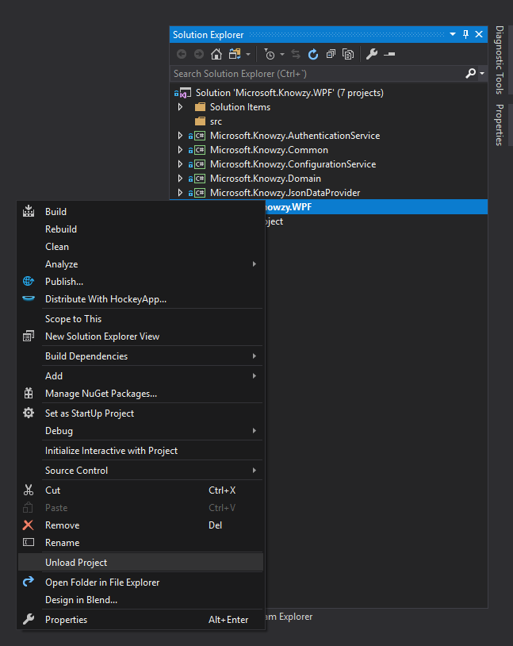
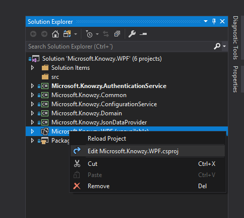
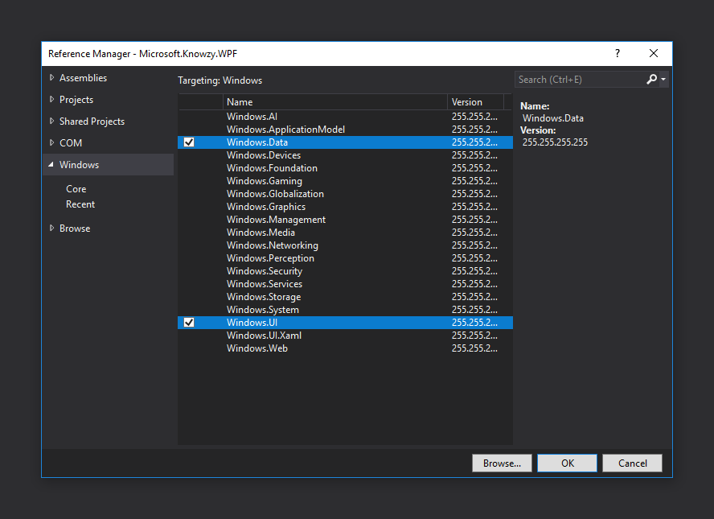
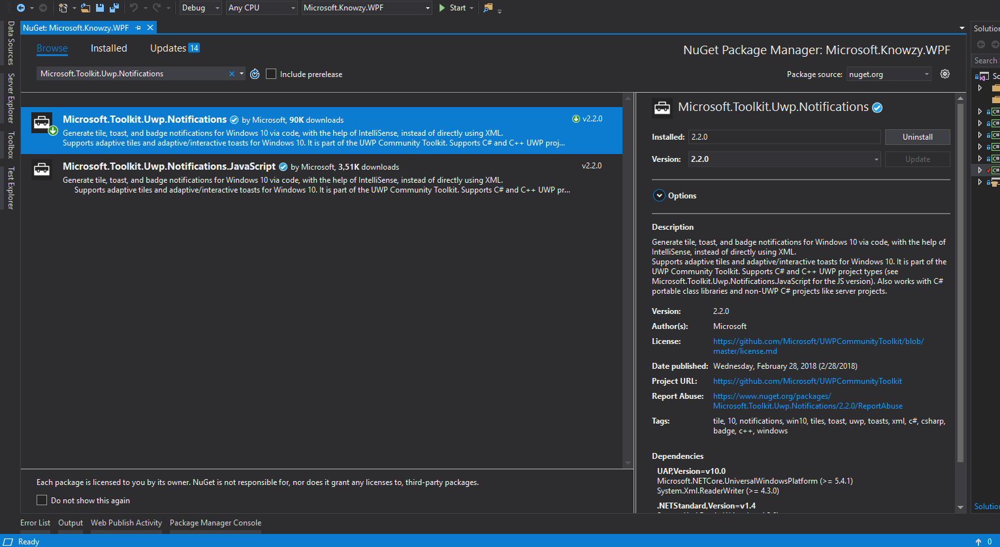
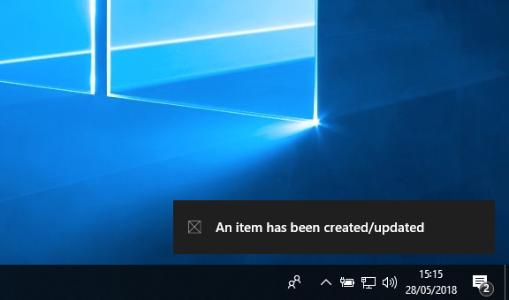
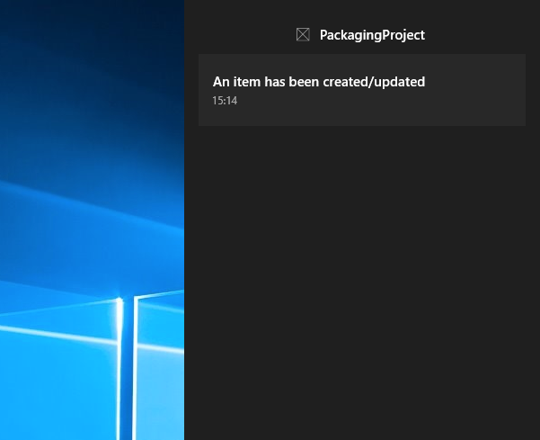

Prerequisites:

-   This lab has a dependency on task **Distribution and versioning** as some Windows 10 APIs require a package identity.

### Send a local Toast Notification from WPF app

Desktop apps can send interactive Toast Notifications just like Universal Windows Platform (UWP) apps. However, there are a few special steps for desktop apps due to the different activation schemes.

#### 1. Enable the Windows 10 SDK

First, we have to enable the Windows 10 SDK for our app. **Right click** on the project **Microsoft.Knowzy.WPF** and select **Unload Project**.

Then **right click** our project again, and select **Edit Microsoft.Knowzy.WPF.csproj**.

Below the existing `<TargetFrameworkVersion>` node, we have to add a new `<TargetPlatformVersion>` node specifying our min version of Windows 10 that we want to support:

~~~~~~~~~~~~~~~~~~~~~~~~~~~~~~~~~~~~~~~~~~~~~~~~~~~~~~~~~~~~~~~~~~~~~~~~~~~~ xml
<AssemblyName>Microsoft.Knowzy.WPF</AssemblyName>
<TargetFrameworkVersion>v4.6.2</TargetFrameworkVersion>
<!-- This is the line to add -->
<TargetPlatformVersion>10.0.10240.0</TargetPlatformVersion>
~~~~~~~~~~~~~~~~~~~~~~~~~~~~~~~~~~~~~~~~~~~~~~~~~~~~~~~~~~~~~~~~~~~~~~~~~~~~

Finally **right click** the project again, and select **Reload Project**.

#### 2. Reference the APIs

Open the Reference Manager (**right click** project, select **Add**, **Reference...**), and select **Windows**, **Core** and include the following references:

-   **Windows.Data**

-   **Windows.UI**

#### 3. Copy compat library code

The compat library abstracts much of the complexity of desktop notifications. Copy the
<a href="https://raw.githubusercontent.com/WindowsNotifications/desktop-toasts/master/CS/DesktopToastsApp/DesktopNotificationManagerCompat.cs" target="_blank">DesktopNotificationManagerCompat.cs</a>
file from GitHub into our project, placing it on the root.

**The following instructions require the compat library.**

#### 4. Implement the Activator

We must implement a handler for toast activation, so that when the user clicks on your toast, our app can do something. This is required for our toast to persist in Action Center (since the toast could be clicked days later when our app is closed).

We need to extend the **NotificationActivator** class and then add the three attributes listed below, and create a GUID for our app (this class can be placed anywhere in our project):

~~~~~~~~~~~~~~~~~~~~~~~~~~~~~~~~~~~~~~~~~~~~~~~~~~~~~~~~~~~~~~~~~~~~~~~~~ csharp
using DesktopNotifications;
using System;
using System.Runtime.InteropServices;

...

[ClassInterface(ClassInterfaceType.None)]
[ComSourceInterfaces(typeof(INotificationActivationCallback))]
[Guid("REPLACE-WITH-YOUR-GUID"), ComVisible(true)]
public class MyNotificationActivator : NotificationActivator
{
    public override void OnActivated(string arguments, NotificationUserInput userInput, string appUserModelId)
    {
        // Intentionally blank
    }
}
~~~~~~~~~~~~~~~~~~~~~~~~~~~~~~~~~~~~~~~~~~~~~~~~~~~~~~~~~~~~~~~~~~~~~~~~~

#### 5. Register with notification platform

We must register with the notification platform. In the **Package.appxmanifest** created on the previous lab:

-   Add declaration for **xmlns:desktop**

-   In the **IgnorableNamespaces** attribute, add **desktop** value

~~~~~~~~~~~~~~~~~~~~~~~~~~~~~~~~~~~~~~~~~~~~~~~~~~~~~~~~~~~~~~~~~~~~~~~~~~~~ xml
<Package [...] xmlns:desktop="http://schemas.microsoft.com/appx/manifest/desktop/windows10" IgnorableNamespaces="[...] desktop">
~~~~~~~~~~~~~~~~~~~~~~~~~~~~~~~~~~~~~~~~~~~~~~~~~~~~~~~~~~~~~~~~~~~~~~~~~~~~

-   Add **desktop:Extension** for **windows.toastNotificationActivation** to declare your toast Activator

~~~~~~~~~~~~~~~~~~~~~~~~~~~~~~~~~~~~~~~~~~~~~~~~~~~~~~~~~~~~~~~~~~~~~~~~~~~~ xml
<Application>
  [...]
  <Extensions>
    <desktop:Extension Category="windows.toastNotificationActivation">
      <desktop:ToastNotificationActivation ToastActivatorCLSID="REPLACE-WITH-YOUR-GUID" />
    </desktop:Extension>
  </Extensions>
</Application>
~~~~~~~~~~~~~~~~~~~~~~~~~~~~~~~~~~~~~~~~~~~~~~~~~~~~~~~~~~~~~~~~~~~~~~~~~~~~

#### 6. Register COM Activator

We must register our notification Activator type, so that we can handle toast activations.

In our app's startup code (see **App.xaml.cs**), call the following **RegisterActivator()** method, passing in our implementation of the
**NotificationActivator** class we created in step \#4. This must be called in order for us to receive any toast activations:

~~~~~~~~~~~~~~~~~~~~~~~~~~~~~~~~~~~~~~~~~~~~~~~~~~~~~~~~~~~~~~~~~~~~~~~~~ csharp
public partial class App : Application
{
    protected override void OnStartup(StartupEventArgs e)
    {
        base.OnStartup(e);

        DesktopNotificationManagerCompat.RegisterActivator<MyNotificationActivator>();
    }
}
~~~~~~~~~~~~~~~~~~~~~~~~~~~~~~~~~~~~~~~~~~~~~~~~~~~~~~~~~~~~~~~~~~~~~~~~~

#### 7. Send a notification

Sending a notification is identical to UWP apps, except that we will use the **DesktopNotificationManagerCompat** class to create a **ToastNotifier**.

If we want to construct notifications using C\# instead of raw XML, we need to install the package **Microsoft.Toolkit.Uwp.Notifications**.

For this exercise we are going to send a Toast Notification when an user creates or updates an item. On **EditItemViewModel.cs** file:

-   Add the references we will need:

~~~~~~~~~~~~~~~~~~~~~~~~~~~~~~~~~~~~~~~~~~~~~~~~~~~~~~~~~~~~~~~~~~~~~~~~~ csharp
using Microsoft.Toolkit.Uwp.Notifications;
using Microsoft.Win32;
using Windows.Data.Xml.Dom;
using Windows.UI.Notifications;
~~~~~~~~~~~~~~~~~~~~~~~~~~~~~~~~~~~~~~~~~~~~~~~~~~~~~~~~~~~~~~~~~~~~~~~~~

-   Create a function that will send the Toast Notification:

~~~~~~~~~~~~~~~~~~~~~~~~~~~~~~~~~~~~~~~~~~~~~~~~~~~~~~~~~~~~~~~~~~~~~~~~~ csharp
private void SendToastNotification()
{
    var toastContent = new ToastContent
    {
        Visual = new ToastVisual
        {
            BindingGeneric = new ToastBindingGeneric
            {
                Children =
                {
                    new AdaptiveText
                    {
                        Text = "An item has been created/updated",
                        HintMaxLines = 1
                    }
                }
            }
        }
    };

    var doc = new XmlDocument();
    doc.LoadXml(toastContent.GetContent());
    var toast = new ToastNotification(doc);
    DesktopNotificationManagerCompat.CreateToastNotifier().Show(toast);
}
~~~~~~~~~~~~~~~~~~~~~~~~~~~~~~~~~~~~~~~~~~~~~~~~~~~~~~~~~~~~~~~~~~~~~~~~~

-   Let's call our new function at the end of the function **SaveAndCloseEditWindow()**

#### 8. Deploying and debugging

As mentioned at the beginning of this lab, some of the Windows 10 APIs require a package identity so, in order for us to debug the Toast Notifications, we should do it over the **PackagingProject** (double-check PackagingProject is set as startup one, and press on the green play button at Visual Studio’s toolbar).

Once the app is running, when we create or edit an item, a toast notification will appear.

Once the notification disappears, we can still see the notification in **Action Center**.

### More Information

If you want to see other visualizations for toast notifications, please visit this <a href="https://docs.microsoft.com/windows/uwp/design/shell/tiles-and-notifications/adaptive-interactive-toasts">link</a>
