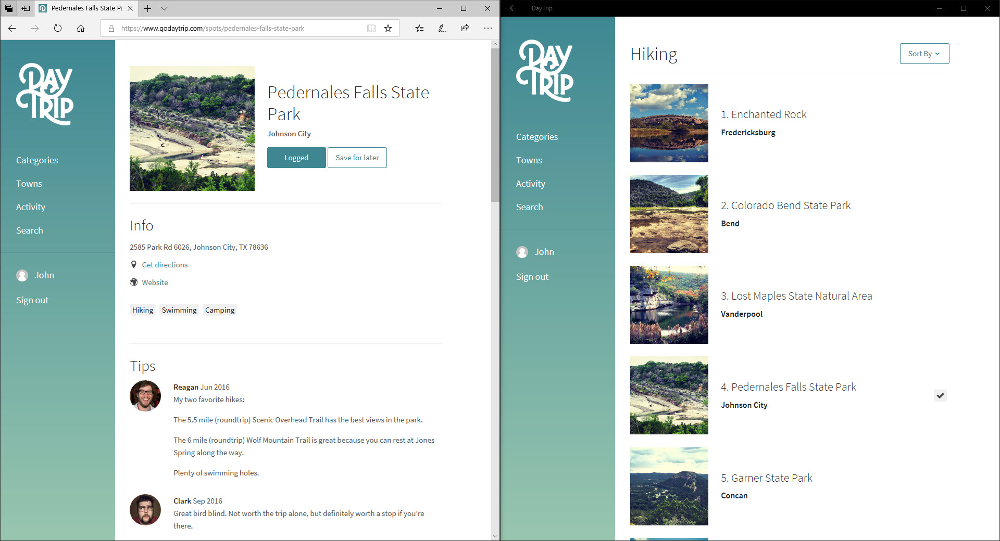

#### What is a PWA?

PWAs are websites, enhanced using modern design and web technologies (Responsive Design, Touch Friendly, Service Workers, Fetch networking, Cache API, Push notifications, Web App Manifest) to provide a more native app-like experience.

#### Manifest, Service Worker, Secure:
To create a PWA, the website will need a manifest, service workers, and be on https. Those elements provide:

   + Standard manifest file: The site requires a manifest file to define the features and behavior of the PWA. The file follows the W3C standard. This includes everything from images, to language, or the start page of your web app.

   + Service workers: The Progressive Web App should have a mechanism (e.g. through a service worker) to help control traffic when the network isn’t there or isn’t reliable. The app should be able to work independent of network.

   + Secure: A secure connection (HTTPS) over your site makes sure all traffic is as safe as a native app. A secure endpoint also allows the service worker to securely take action on the behalf of your app.

### Running across platforms

#### Supported Platforms:

PWA apps are still websites, and are therefore supported on most platforms including Windows, Android, iOS and Mac. They can be enhanced to function more like native apps, and even use native APIs on support platforms. A PWA can combine the best features of a web site and a native application.

#### Running PWA in a browser:

PWAs aren't very different that a web application, when you access to a PWA you will see the same as a simple web application.
After complete this lab, your PWA will looks like this:

**Some PWA examples:**

+ Twitter <a href="https://twitter.com" target="_blank">website</a>  and <a href="https://www.microsoft.com/store/p/twitter/9wzdncrfj140" target="_blank">store app</a>.

+ Trivago <a href="https://www.trivago.es/" target="_blank">website</a> and <a href="https://www.microsoft.com/store/p/trivago/9nv9sdq842gq" target="_blank">store app</a>.

+ DayTrip <a href="https://www.godaytrip.com/" target="_blank">website</a> and <a href="https://www.microsoft.com/store/p/daytrip/9nfdsvs69k6m" target="_blank">store app</a>.

Looking at these examples, can you tell the difference?
