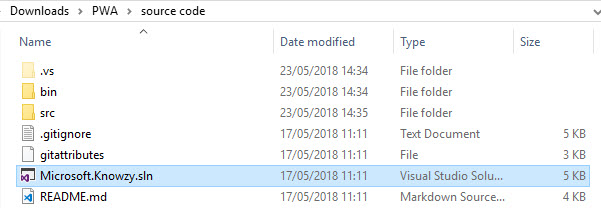
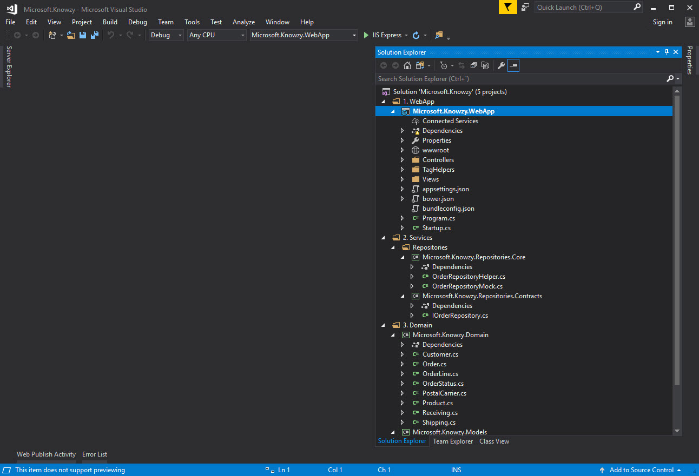
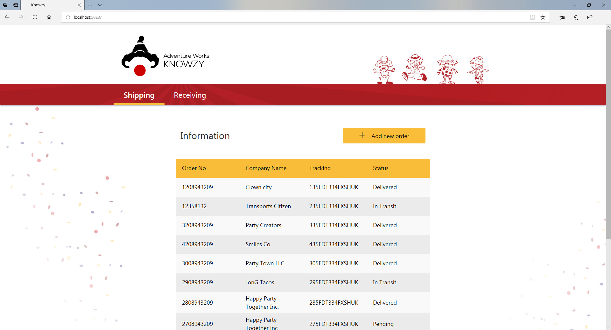
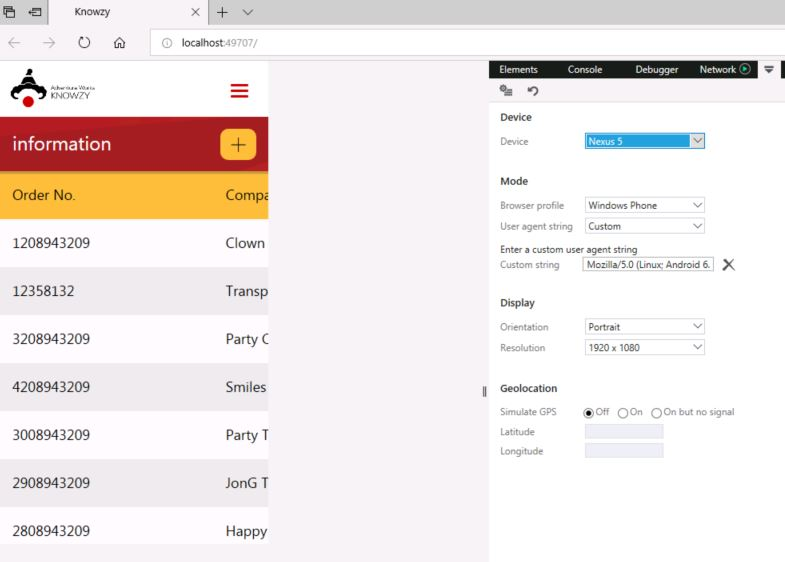
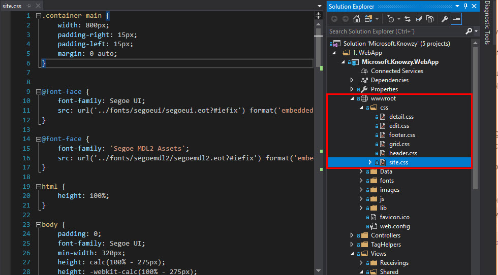
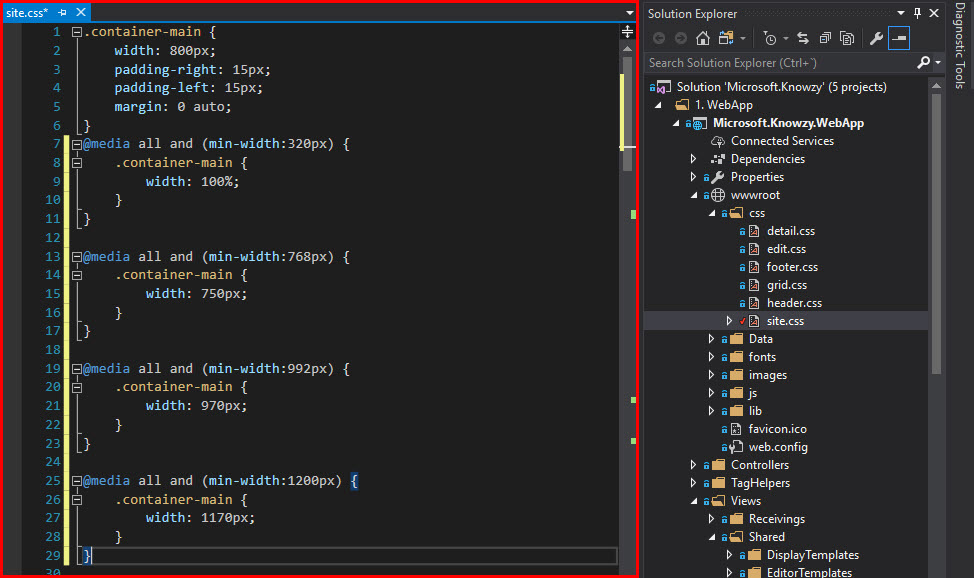
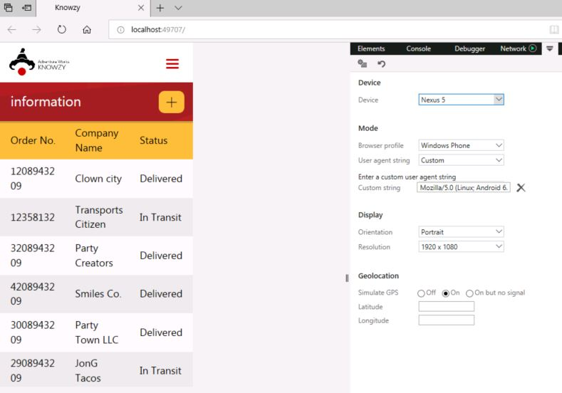
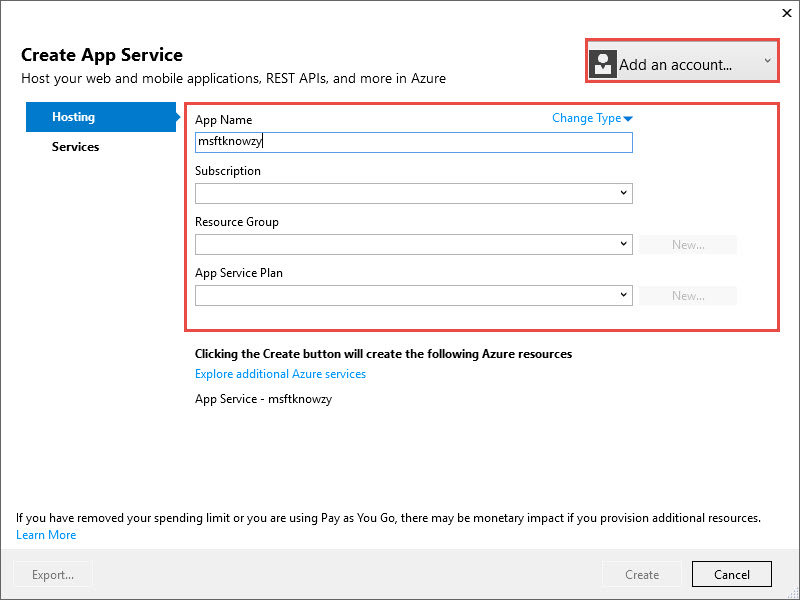
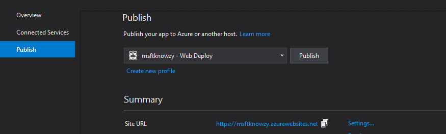
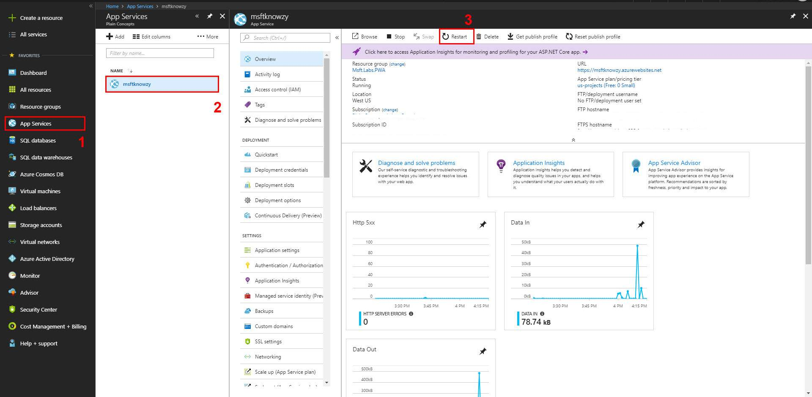

This part is **optional**, if you want to use our Knowzy <a href="https://www.asp.net/" target="_blank">ASP.NET</a> example project continue with this part.

> Note: Ensure you have the _.NET Core 1.0 - 1.1 development tools for Web_ component installed inside of the **Visual Studio Installer**

1. To start, clone or download the <a href="https://github.com/Microsoft/InsiderDevTour18-Labs" target="_blank">repository code</a> and open the folder: `PWA/source code/`

2. Execute the **Microsoft.Knowzy.sln** solution to open the project in Visual Studio.



3. Now to run your web app in a browser, hit F5 in Visual Studio or click on the start button:




### Responsive Web Design

Responsive web design makes your web page look good on all devices (desktops, tablets, and phones) because use HTML and CSS to resize, hide, shrink, enlarge, or move the content to make it look good on any screen.

Our website doesn't have a responsive design; let's see what happens if I simulate a mobile screen, such as on a Galaxy S5 (360 x 640px):


Here we can see that the header is adapted but the list seems need to be fixed. To adapt it to the screen we will add some media queries.

**What are media queries?**

Media queries are a feature of CSS that enable webpage content to adapt to different screen sizes and resolutions.

#### Make your website responsive.

To view your application in a mobile phone, first we have to fix the previous list. The problem is in a CSS class named `container-main` because it has a fixed width:

```css

.container-main {
    width: 800px;
    padding-right: 15px;
    padding-left: 15px;
    margin: 0 auto;
}
```


1. To fix it go to the site.css at the following path: `\wwwroot\css\site.css`


2. To adapt it to some screens add some media queries to modify the container width to different screen sizes like 320px, 768px, 992px, and 1200px:

    ```css

    @media all and (min-width:320px) {
        .container-main {
            width: 100%;
        }
    }

    @media all and (min-width:768px) {
        .container-main {
            width: 750px;
        }
    }

    @media all and (min-width:992px) {
        .container-main {
            width: 970px;
        }
    }

    @media all and (min-width:1200px) {
        .container-main {
            width: 1170px;
        }
    }
    ```

    Be sure to add these rules *below* the "container-main" rule, so the media queries will override the width of the main rule.



Congratulations! Your app is now ready to be viewed on devices with different screen sizes and orientations.
    


#### Deploy your <a href="https://www.asp.net/" target="_blank">ASP.NET</a> App Changes (optional)


Now if you want to publish the application on Azure follow these steps or continue locally using IIS and skip to the next step.

**Important!** you will need an Azure account to use Azure services, if don't have any you can create for free in <a href="https://azure.microsoft.com/free/" target="_blank">Azure</a>.
For more information you can follow this small tutorial: <a href="https://www.acronis.com/articles/create-microsoft-azure-account/" target="_blank">How to create up a new Microsoft Azure account.</a>

Using azure services:

1. In Visual Studio select the "Microsoft.Knowzy.WebApp" in the solution explorer, then choose Build > Publish.

    **NOTE:** Some configurations of Visual Studio may have the "publish" option as its own menu.

    

2. Choose "Microsoft Azure App Service" from the selection screen

    

3.  Sign into your Azure account to create a new Azure App Service.

    **Important!** Use the **default Web App Name** to avoid conflicts.

    Press **New** button to create the Resource Group, and the App Service Plan.

    

4. Click "Create" to create the app in Azure. When it finishes you should see **Publish** as the next step:

    

    Save the generated **Site url**; this is the url of your published website.

5. Click on the **Publish button** with the application stopped. When it finishes, it will automatically show the application.

    


### Deployment Errors
* When attempting to deploy, you may run into an issue where Azure complains that a certain .dll is locked. If this is the case, you'll have to perform the following steps:
    1. Sign into <a href="https://portal.azure.com" target="_blank">https://portal.azure.com</a> with the same credentials you used to deploy your web app

    2. Select **App Services** from the left-most menu (see 1 in the figure below)

    3. Select your web app (see 2 in the figure below)

    4. Press **Restart** on the top menu bar (see 3 in the figure below)

        

    5. Once your web app has finished restarting, you should be able to re-deploy your web app.
