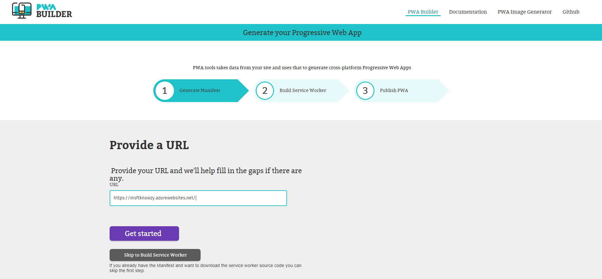
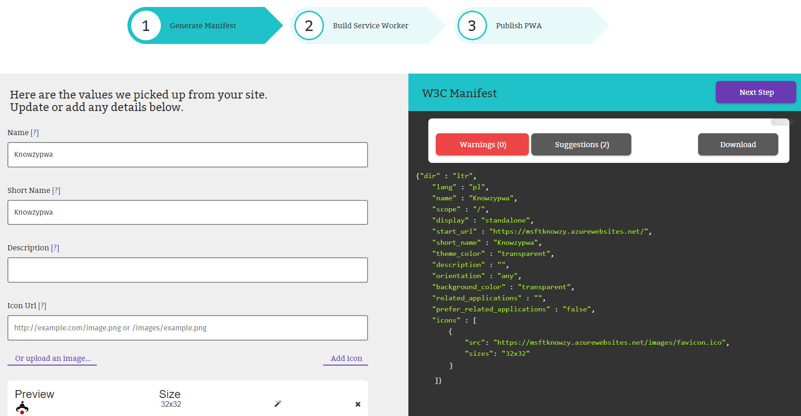
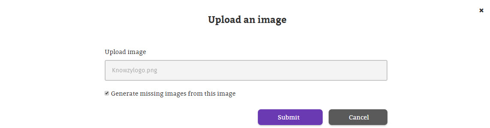
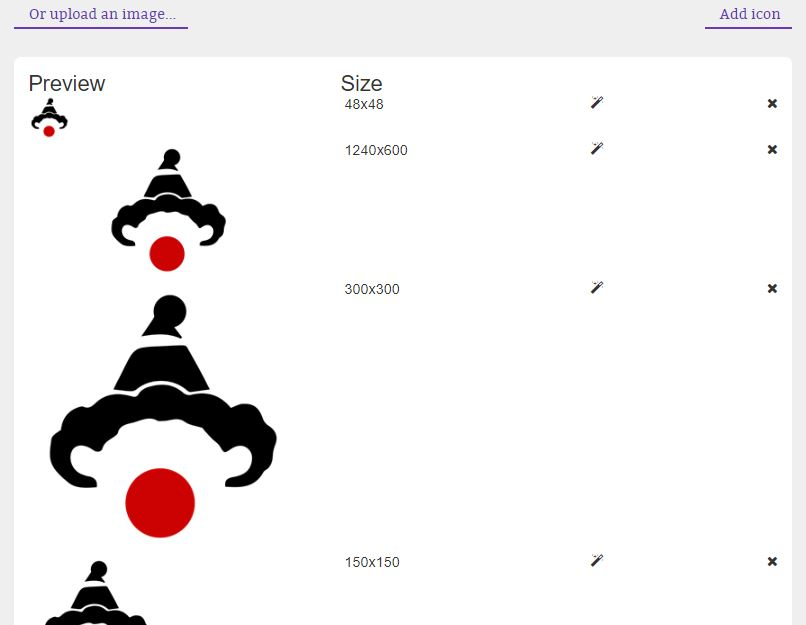
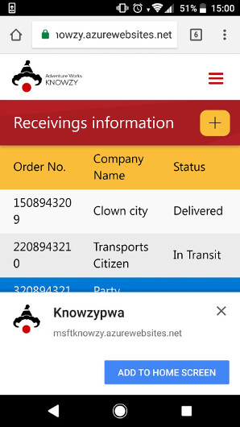
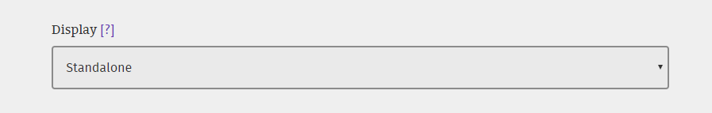

### Prerequisites

This task has a dependency on **Build a Responsive Web App** section and the prerequisites found there.

### Manifest

The **Manifest for Web Apps** is a JSON-based manifest file that provides a centralized place to put metadata associated with a web application (like app name, icons, presentation, etc.), thus solving the problem of having to maintain an heterogeneous set of meta tags and link tags to support each platform. PWAs use this manifest to control the appearance and behavior of the app when it is installed and launched from the user device.

Some parameters you can find in a manifest:
+ The `name`:
The **name member** is a string that represents the name of the web application that is usually displayed to the user (e.g., amongst a list of other applications, or as a label for an icon).

+ The `short_name`:
The **short_name member** is a string that represents a short version of the name of the web application. It is intended to be used where there is not enough space to display the full name.

+ The `scope`:
The **scope member** is a string that represents the navigation scope of the web application's context.

+ The `icons`
The **icons member** is an array of ImageResources that can be use as an icon for the web application in various contexts. For example, they can be used to represent the web application amongst a list of other applications, or to integrate the web application with an OS's task switcher and/or system preferences.

Learn more about the content in <a href="https://www.w3.org/TR/appmanifest/#webappmanifest-dictionary" target="_blank"> webAppManifest dictionary</a> from W3C.

#### Provide a URL

The first step is to build the Manifest for your application using the **pwabuilder.com** web site. This tool will look in the home page for information about the app in specific HTML meta tags.

1. Open a browser and navigate to <a href="https://preview.pwabuilder.com/" target="_blank">https://preview.pwabuilder.com/</a>.
2. In the URL textbox, enter the https URL of your web app and click on **Get Started**.

    > **Note** Your website URL will likely default to the http version in the browser but all Azure websites also have a valid https certificate so https can be used on any Azure website.

#### Generate manifest
The builder will search in the home page of your site looking for an existing manifest. If a manifest is not found, it will gather information about the app in specific meta tags or propose default values for the manifest properties. It will also show any warnings or suggestions to address potential issues in the collected metadata. Be sure you address any warnings before you move on.

> **Note:** Try adding a description to your manifest.

#### Add Images

The builder site also checks whether the manifest has defined the expected icon sizes for the different platforms (Windows, Android, iOS) and helps to generate the missing sizes.

1. For our site, we don't have any image defined in the manifest so we'll proceed uploading an image with our app logo. To do this, click on the **Upload an image** link.

2. Save the below Knowzy logo to your PC by right clicking and selecting **Save image as**.

    

3. Browse to the location of the image you downloaded and if you want to generate the missing sizes, make sure the **Generate missing images from this image** checkbox is marked.

    > **Note:** The **Upload image** option will generate the required image sizes for Windows 10, and suggested images for other platforms.

    

4. Click **Submit**. In our example, the missing image sizes are automatically generated and added to the manifest.

    

  > **Note:** The next options are required to show the download banner in other devices:
  >+ The `short_name ` (used in home page)
  >+ The `name` (used in the banner to download)
  >+ An icon png 192x192 size (pwabuilder generates it automatically)
  >+ The `start_url` ( set the home page for the application when users access from a different device)

  It is difficult to see the download banner, the result might be like the next image but for now let's continue to the next step.

5.  Change the display mode to `Standalone` as we want the web application to look and feel like a standalone native application.

#### References

- <a href="https://preview.pwabuilder.com/" target="_blank">PWA Builder</a>
