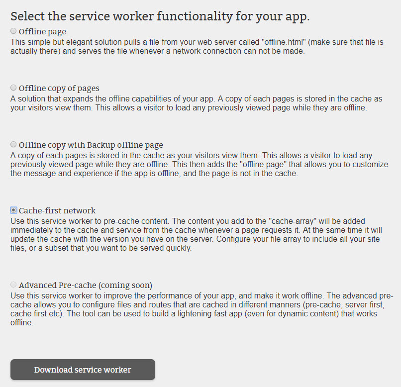

During this step you will choose functionalities you want to add to your app. The builder will include code to use sample service workers implementing those features from a repository. 
*<a href="https://docs.pwabuilder.com/what/is/a/pwa/2018/02/03/what-is-a-service-worker.html" target="_blank">Learn more about service workers</a>.*

There are a number of service workers to choose from, but Knowzy is looking for a way to make sure its field agents can access the app data when they have poor or no network connection.

1. For this functionality we'll choose the "Cache-first network" service worker.

2. How to add the manifest and service worker to your site, will be explained in the **Add manifest and service worker (sw)** section.  
