This task has a dependency on **Step 1 Generate Manifest** and **Step 2 Build Service Worker** to download the necessary code to transform your web application into a PWA.

### Publish PWA
 Once you have done the previous steps 1 and 2 of the **PWABuilder** tool, go to step 3 to download the generated code for your web app.

 The destination path of these files will be the scope of your project that you have defined previously in the manifest; in this case it's the **wwwroot** because in our manifest we have specified the **./** root path.

> Remember: The scope member is a string that represents the navigation scope of this web application's context.


+ Download the Web and Windows 10 code (you will use the Windows 10 downloaded files later).

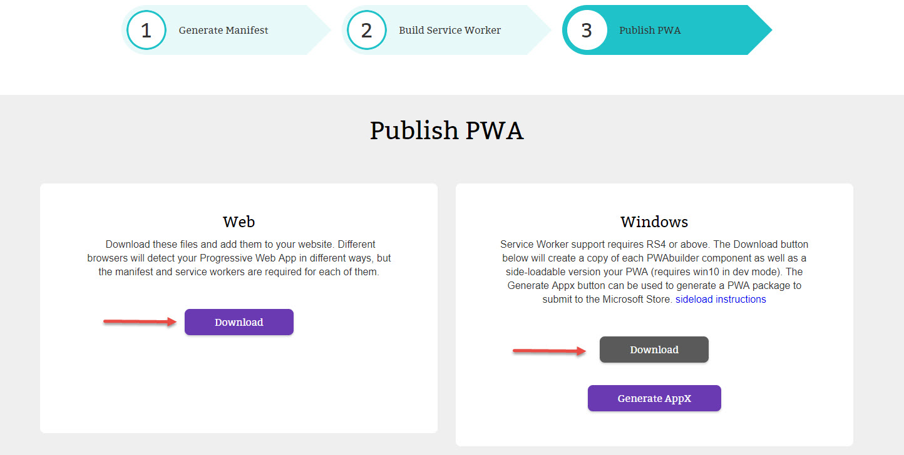

#### Add manifest to your site

1. Open the **WEB** downloaded files and go to the PWA folder inside projects (ex: \Downloads\Knowzy-web\projects\PWA).
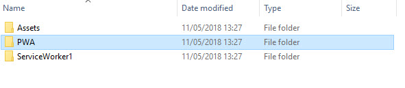

2. Copy the "manifest.json" file and the "images" folder that are inside of the PWA folder that you obtained from the zip file in the previous step.
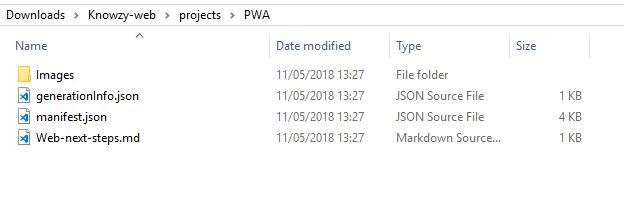

3. Paste the manifest.json and the **Images** folder to the **wwwroot** path of your site (ex: ...\source code\src\1. WebApp\Microsoft.Knowzy.WebApp\wwwroot).

    >Remember, if you change the path of your **Images** folder, you need to update the json in your manifest file to reflect your changes.

    Using our Knowzy <a href="https://www.asp.net/" target="_blank">ASP.NET</a> project the easiest way to add new content to a project is to drag and drop the content from the file explorer into the solution explorer of your project.

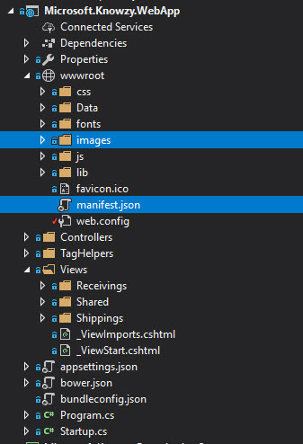

4. Reference the manifest in your **/Views/Shared/_Layout.cshtml** page with a link tag:

    ````html
    <link rel="manifest" href="manifest.json">
    ````

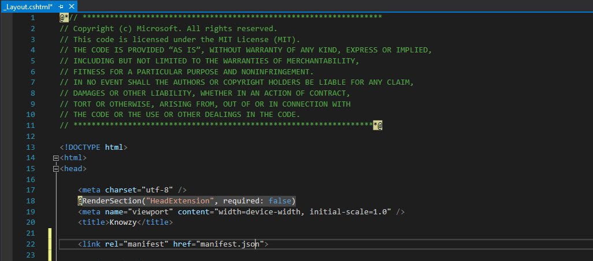


#### Add Service Worker code to your site

Return to your downloaded PWA folder and go to projects (Downloads\Knowzy-web\projects\)

1. Copy **only** the pwabuilder-sw.js file from the **ServiceWorker4** folder to the wwwroot of your site.
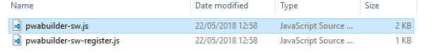

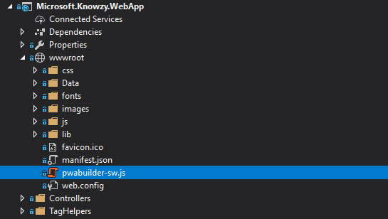

2. Open up the landing page of your app (_Layout.cshtml) and add a new script tag in the head after the manifest link.
      ```html
        <link rel="manifest" href="manifest.json">
        <script></script>
      ```

3. Add the following registration code inside the new script tag:

    ```js
    //This is the service worker with the Cache-first network

    //Add this below content to your HTML page, or add the js file to your page at the very top to register service worker
    if (navigator.serviceWorker.controller) {
      console.log('[PWA Builder] active service worker found, no need to register')
    } else {

    //Register the ServiceWorker
      navigator.serviceWorker.register('pwabuilder-sw.js', {
        scope: './'
      }).then(function(reg) {
        console.log('Service worker has been registered for scope:'+ reg.scope);
      });
    }
    ```

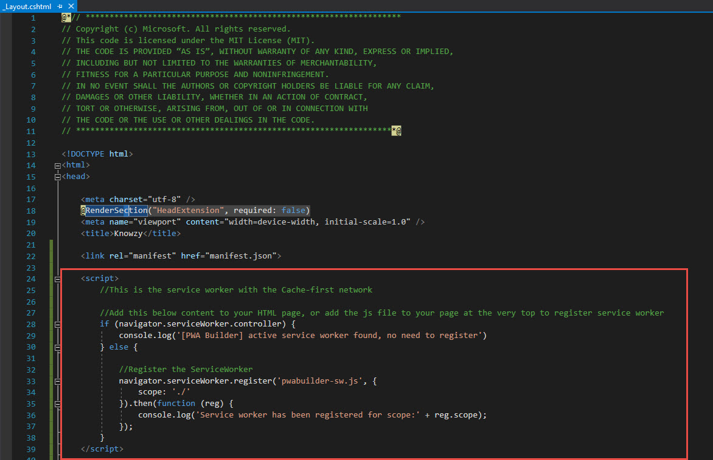

#### Test locally
To test that your service worker is successfully installed, launch the app locally. Make sure you are in the Microsoft.Knowzy.WebApp project and click on **IIS Express** button.
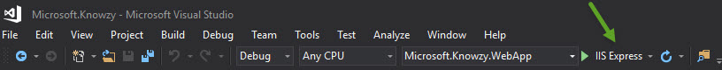

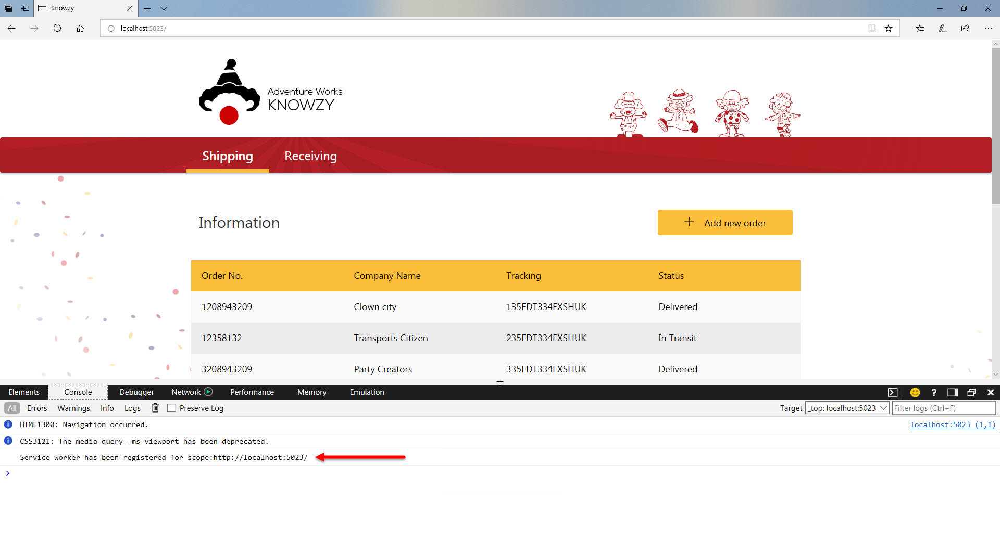

#### Re-Publish Changes (optional)

Now that you have these powerful new features running locally, you can publish them to your website to be consumed as a PWA.

1. In Visual Studio choose Project > Publish... or right click on Microsoft.Knowzy.WebApp and publish.

    

2. Choose "Microsoft Azure App Service" from the selection screen.

    > **NOTE** if your Visual Studio project is still debugging your Azure server or your local server, you may need to halt the server before re-publishing.

    

3. Click on "Publish button", it will show automatically the application result when finished.

    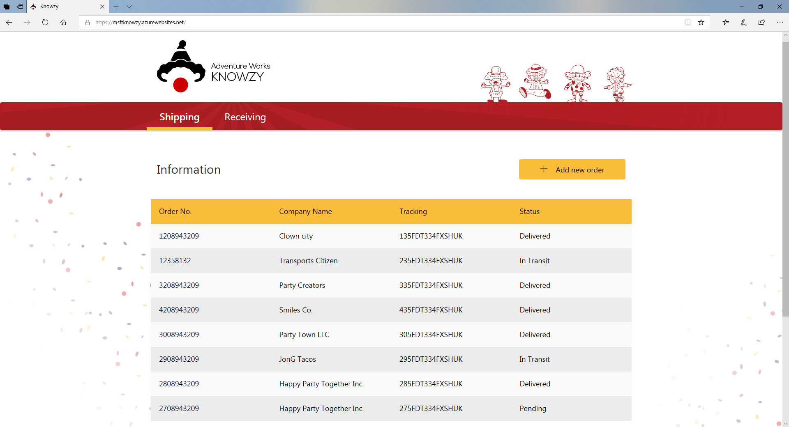

  ```Important!``` To show the download banner from other devices, the website **must be accessed at least twice.**
   *<a href="https://developers.google.com/web/fundamentals/app-install-banners/" target="_blank">Learn more about app install banners</a>.*
   In case you have any issues you can do it manually through the Chrome settings, `add to home screen`:

  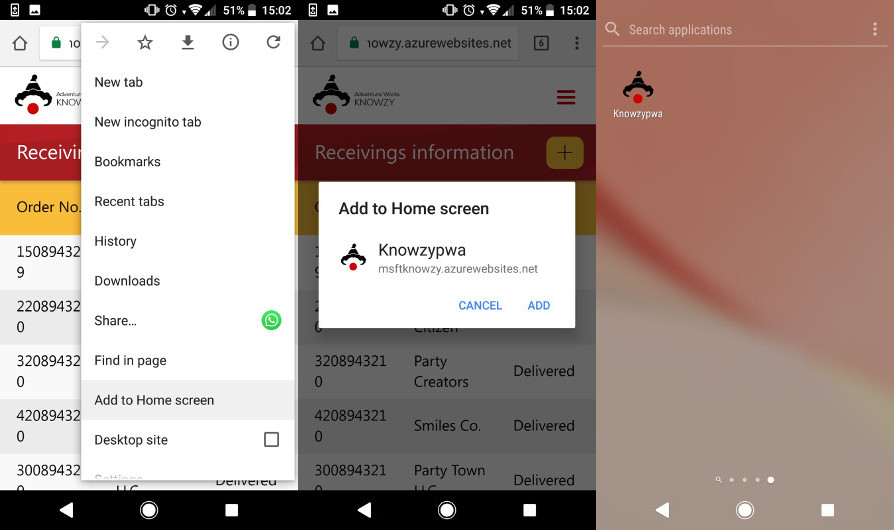
