This section is intended to test the PWA app in multiple platforms.

### Prerequisites:

- This task has a dependency on **Build a PWA with PWA Builder** section

###	How to test on Windows 10

#### Sideload a PWA

In case you do not want to distribute your app through the Microsoft Store, you can side-load the app package directly to a device.

1. Make sure your PC is in **dev mode**. Go to “Settings > Update & Security > For developers” and then activate dev mode.

2. Go to the downloaded Windows 10 files (on the previous lab)

3. Open the **Windows 10** folder and right click on the file called “test_install.ps1” and run it with Powershell.
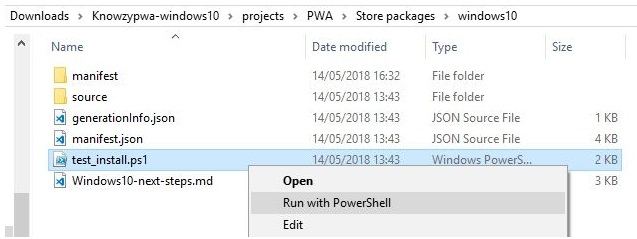

4. Open your Start menu / Start screen and look for the app in the “recently added” section or search for the name from your manifest. Launch the app and check that it works as expected.

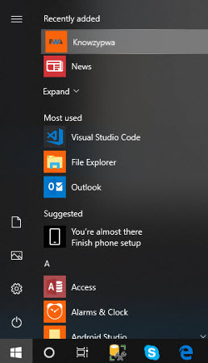
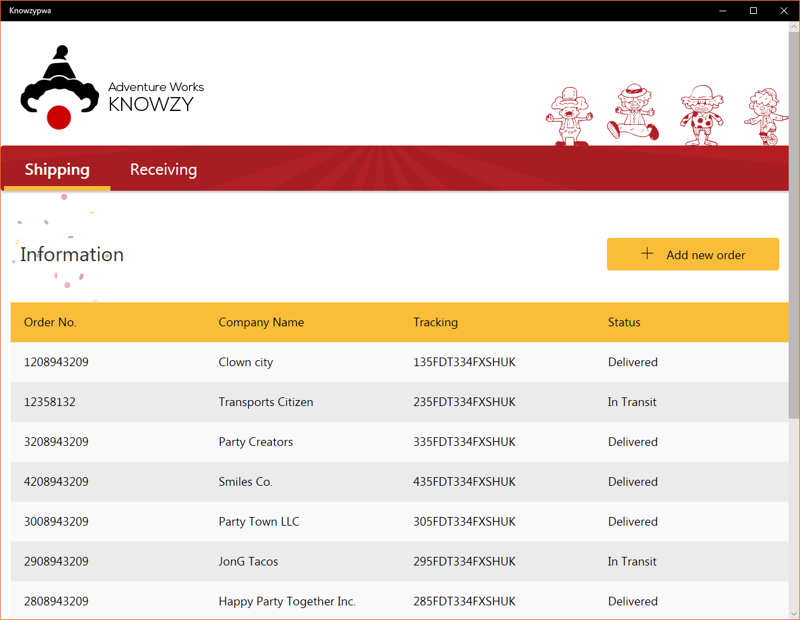 

#### F12 tools for PWA

Prerequisites:
- Install the **Microsoft Edge DevTools** <a href="https://www.microsoft.com/store/productId/9MZBFRMZ0MNJ" target="_blank">download here.</a>

The **Microsoft Edge DevTools** provide web developers with tools for attaching to open local and remote page targets and debug web content in web sites and apps on Windows.

1. Launch the app you have previously installed.

2. Launch the Edge Dev tools and select the app to attach to the process.

 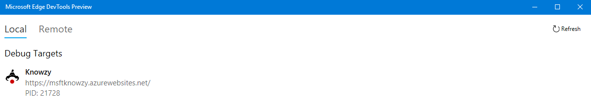 

3. Go to the debugger tab and under the service worker section verify that the service worker is up and running.

 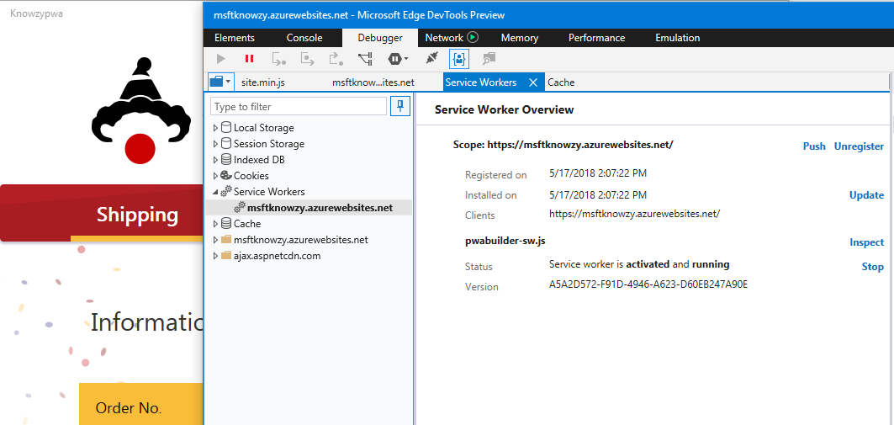 

4. Now under the **Cache** section, verify that the app is caching content.

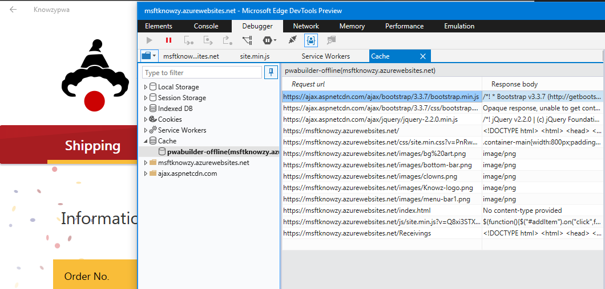 

###	How to test on Chrome or the next version of Microsoft Edge

1. Open up our app using the Chrome browser or the next generation of the <a href= "https://www.microsoftedgeinsider.com/" target="_blank">Edge browser</a>, <a href="https://msftknowzy.azurewebsites.net/" target="_blank"> using this PWA App link</a>.

2. Open up the F12 tooling in the browser and select the `Application` tab.

3. Select the `Manifest` option and check that the manifest has been found and settings are correct.

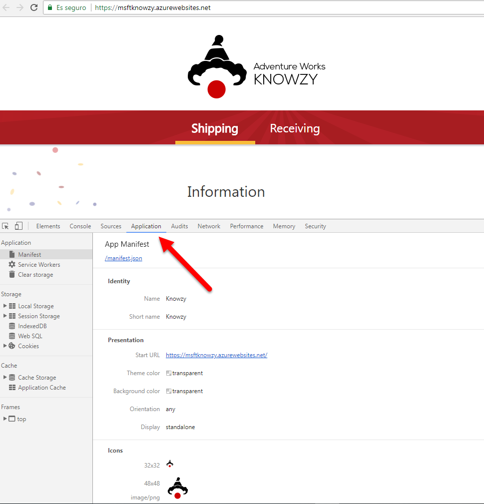 

4. Select the `Service Workers` option and check that the service worker is up and running.

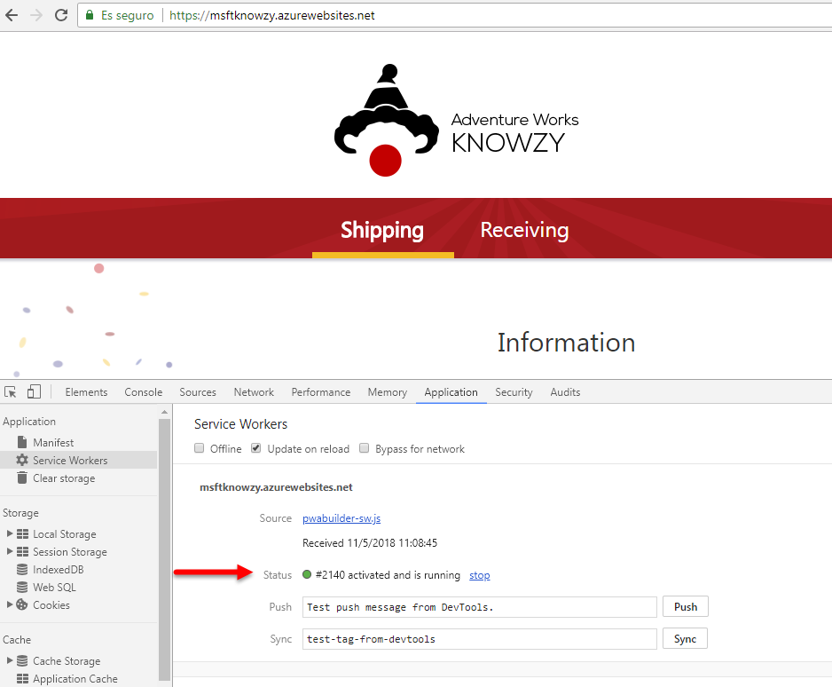 

5. Navigate to `Receiving` page and check that the path to `Receiving page` has been added to the **Cache Storage** in the **Cache** section:

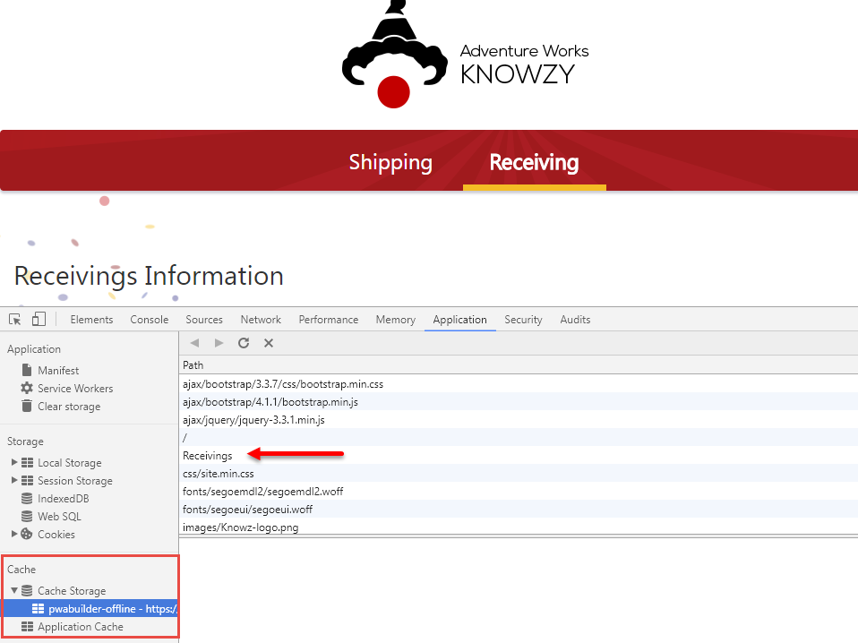 

6. Check that the offline service worker feature is working fine by going to the **service worker** section, and selecting the `Offline` checkbox and reload the page. The `Receiving page` should be shown even though you are offline.

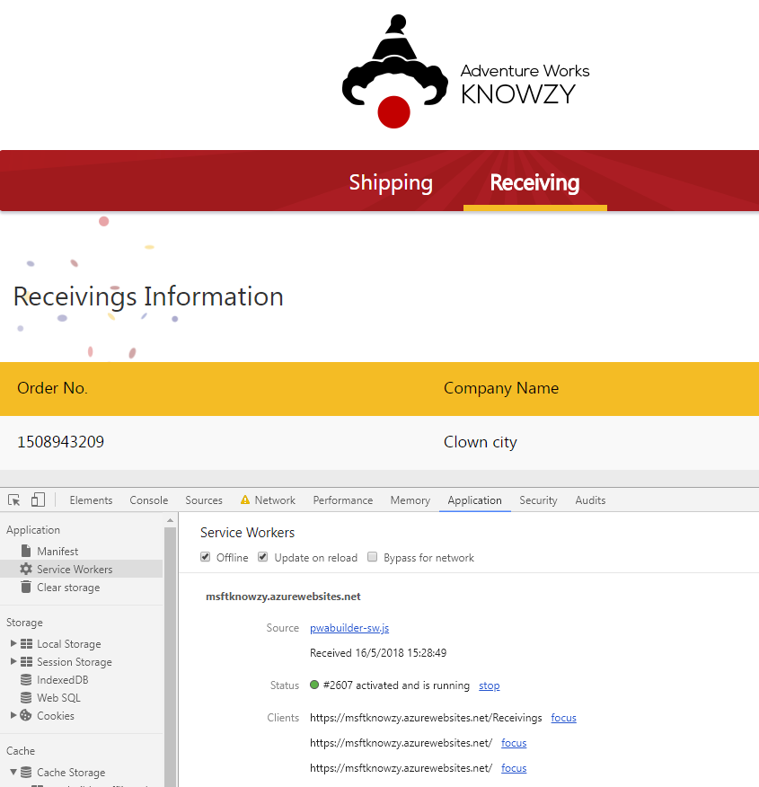 

#### How to test on iOS

1. Open up the Web app using Safari browser <a href="https://msftknowzy.azurewebsites.net/" target="_blank"> by clicking on this Web App link</a>.

2. Select `Add to Home Screen` button in order to install the app on the device.

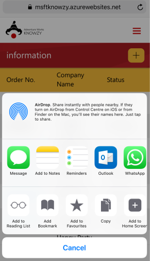 

3. Add a name that will be shown once installed on the device

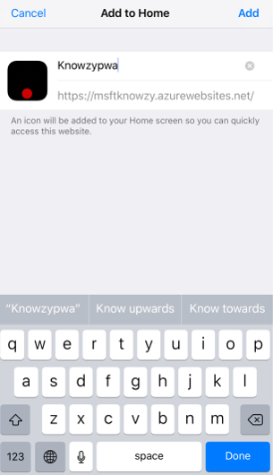 

4. Verify that the app is installed.

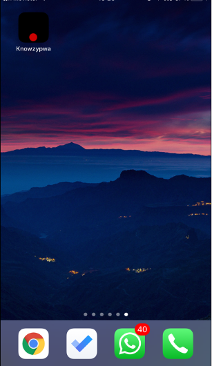 

5. Launch the app and verify that works properly.

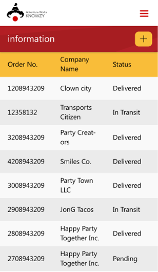 
