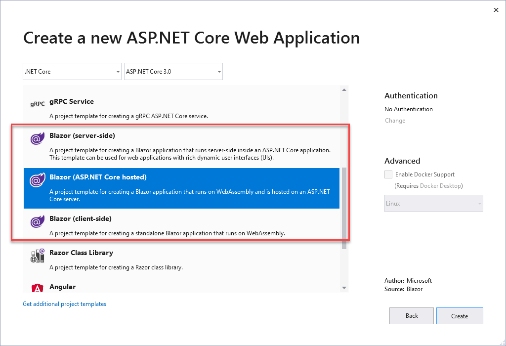
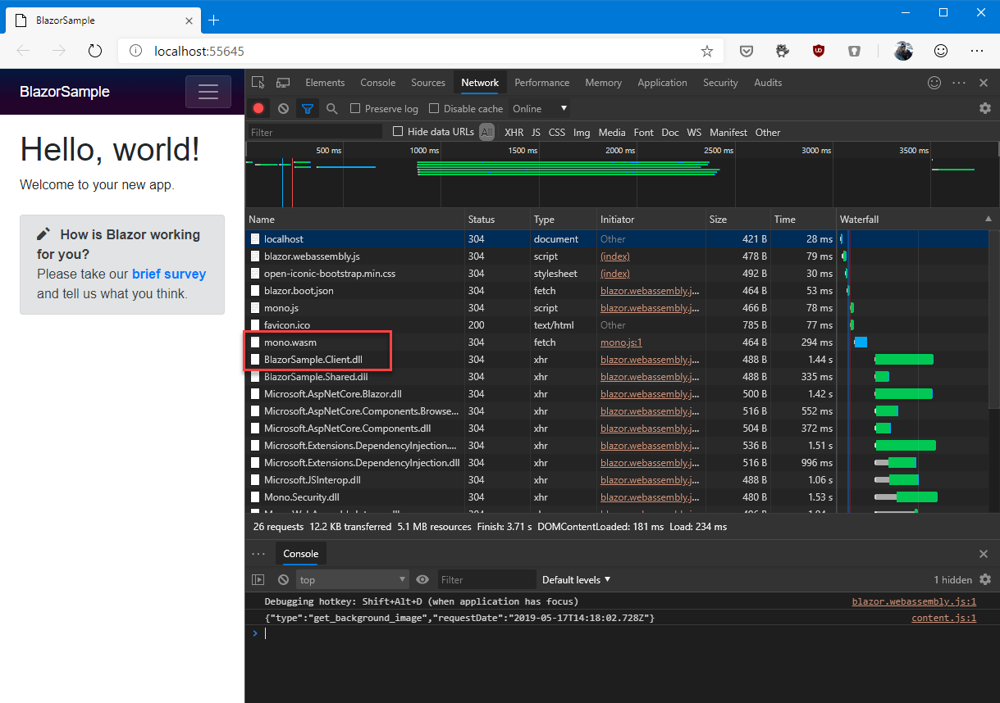
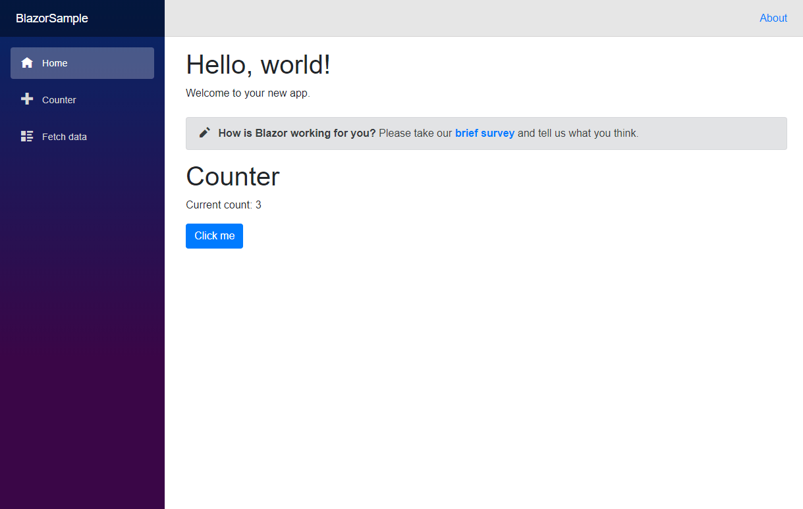
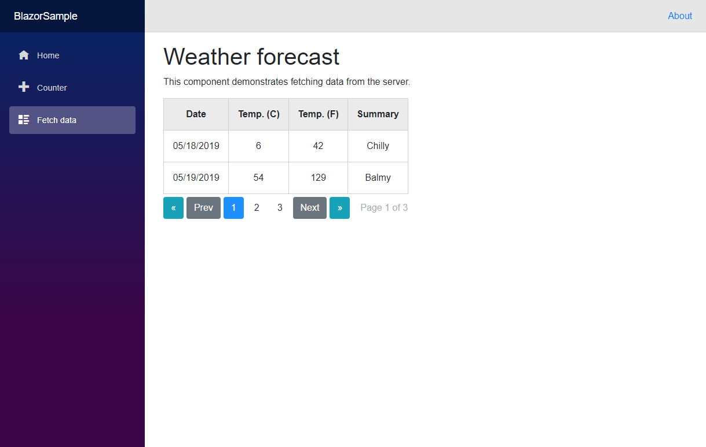

# Demo 1 - Blazor

1. Launch Visual Studio 2019
2. Choose **Create a new project**
3. Choose **ASP.NET Core Web Application**
4. Name it **BlazorSample** and save it in a folder of your preference.
5. Show to the audience the various Blazor templates. Choose **Blazor (ASP.NET Core hosted)**

    

6. Show to the audience the various projects in Solution Explorer and explain their meaning:
    - **BlazorGridSample.Client** is the main project and it runs completely client side thanks to WebAssembly
    - **BlazorGridSample.Server** is the backend, which supports operations that can be performed only server-side, like accessing to a database
    - **BlazorGridSample.Shared** is a .NET Standard library. Since both are ASP.NET Core projects, you can freely share code between the two. This project contains the definition of an entity, **WeatherForecast**, which is shared across the two.
7. Make sure **BlazorGridSample.Server** is set as startup project and press F5.
8. Once the web application starts, show the various pages of the application, like Counter and Fetch Data. Interact with them, to demonstrate that everything is running client side.
9. Go back to Visual Studio 2019 and briefly show the code of the **Counter.razor** and **FetchData.razor** files in the **Pages** folder. Highlight how there’s no JavaScript, all the logic is C#.
10. As a final proof, press F12 in Edge to open the Developer tools and move to the **Network** tab.
11. Reload the page by pressing CTRL-R
12. Show to the audience how the web application is not loading only HTML, CSS and JavaScript files, but also .dll and .wasm files:
    - Call out specifically **mono.wasm**, which is the web assembly implementation of Mono leveraged by Blazor.
    - Call out specifically **BlazorGridSample.Client.dll**, which is the application built in Visual Studio.
    
    
    
13. Now let’s talk about components! Every element in Blazor is a component, that can be easily reused.
14. Go back to Visual Studio 2019 and highlight how every file inside the Pages folder of the project isn’t actually a page, but a .razor file, which can be used as a single page or as a component hosted in another page
15. Open the **Index.razor** file inside the **Pages** folder
16. Add the following code at the end of the file:

    ```xml
    <Counter />
    ```

17. Press F5 and launch again the website. Highlight how the counter is now being used as a component and displayed inside another page.

    
    
18. Components can be also packaged in libraries that can be shared with other developers. The community and vendors like Telerik, Syncfusion and DevExpress are building more and more components for developers. Let’s see how we can replace the simple table we have in the FetchData page with a more complex grid, which supports advanced features like pagination.
19. Open the **FetchData.razor** file under **Pages** and show to the audience how the table is manually built using a foreach loop on the weather forecasts collection.
20. Now right click on the solution in Visual Studio and choose **Add -> Existing project**.
21. Look for the **BlazorGridComponent.csproj** file inside the folder **01-Blazor\01-Start\BlazorGridComponent** and select it
22. Now right click on the **BlazorGridSample.Client** project and choose **Add reference**.
23. Choose **Projects -> Solution** and select the **BlazorGridComponent** project you have just added.
24. Now go back to the **FetchData.razor** file in the **Pages** folder
25. Add, at the top of the file, the following statement:

    ```csharp
    @using BlazorGridComponent
    ```
26. Delete the existing table and replace it with the following code:

    ```xml
    <BlazorGrid Items="@forecasts" PageSize="2">
        <GridHeader>
            <th>Date</th>
            <th>Temp. (C)</th>
            <th>Temp. (F)</th>
            <th>Summary</th>
        </GridHeader>
        <GridRow>
            <td>@context.Date.ToShortDateString()</td>
            <td>@context.TemperatureC</td>
            <td>@context.TemperatureF</td>
            <td>@context.Summary</td>
        </GridRow>
    </BlazorGrid>
    ```
    
27. Press F5 and launch the web application again. Once it's loaded, move to the **Fetch data** page and show how the data is now being formatted with a different grid, which supports pagination as well.


    


