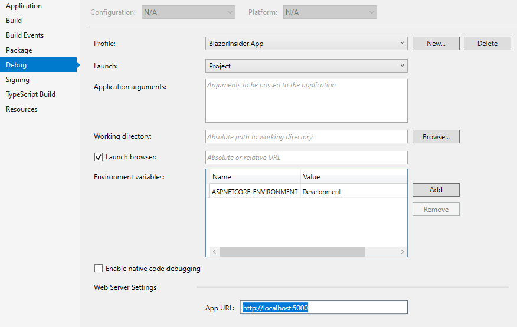
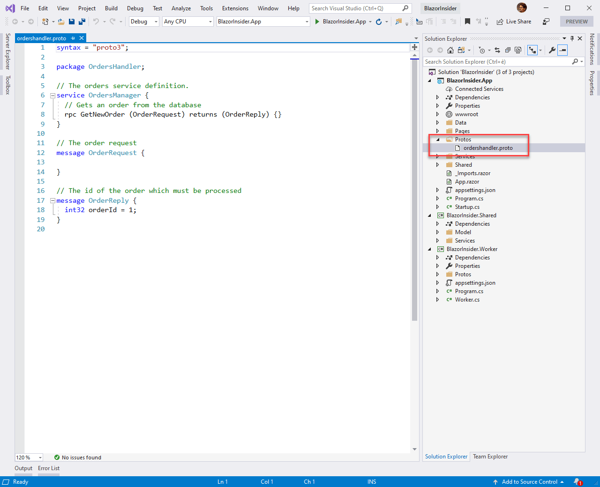
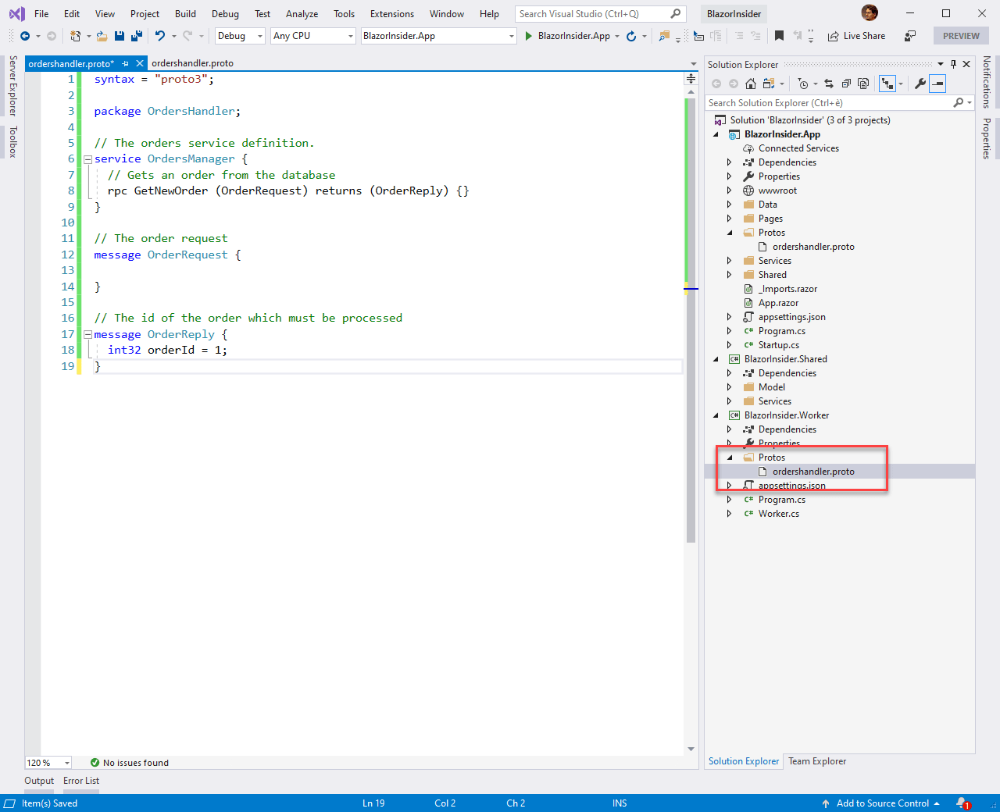
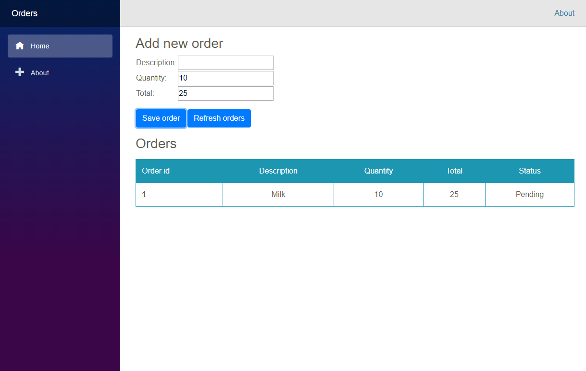
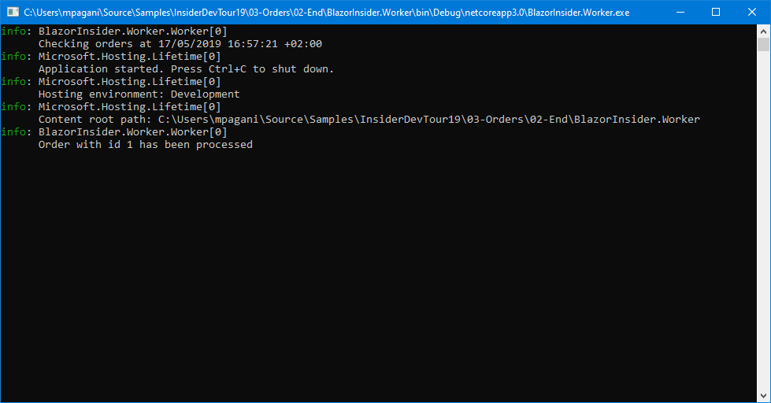
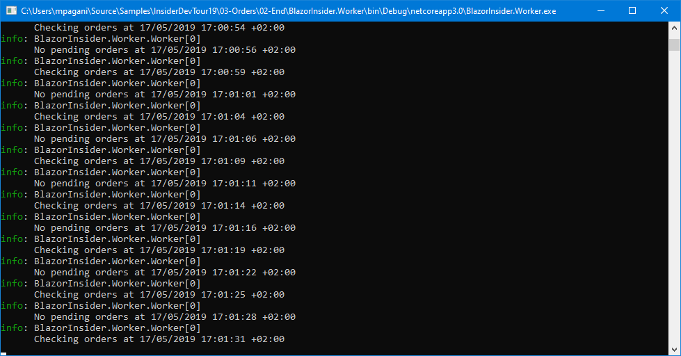
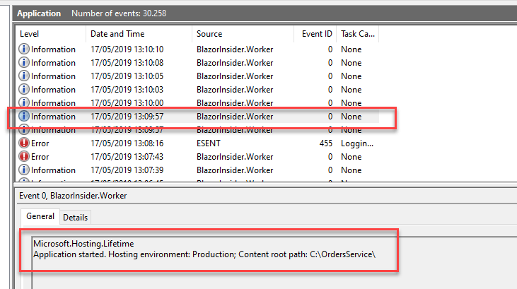
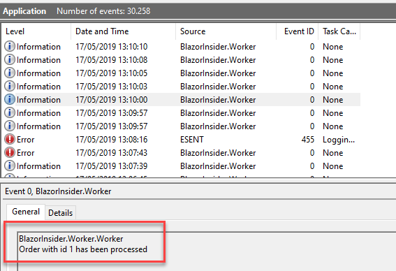
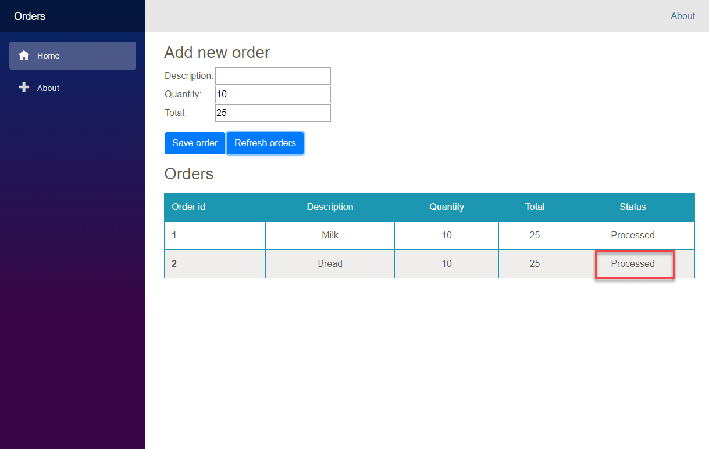

# Demo 3 - Full stack architecture

**Please note**: Make sure that, in the **BlazorInsider.App** project properties, the two following settings are defined in the **Debug** tab:

- **Launch browser** must be checked
- **App URL** must be set to **http://localhost:5000**

    
    
Otherwise, the browser won't be automatically launched when you start the debugging.

1. The goal of this demo is to put together all the pieces you have demonstrated so far.
2. Open the **BlazorInsider.sln** solution with Visual Studio
3. Show to the audience the 3 different projects and explain them:
    - **BlazorInsider.app** is the frontend of the application. This is a Blazor server side application, which isn't running using WebAssembly but it's rendered on the backend and dispatched to the browser using SignalR. The goal of this application is to allow the user to enter one or more orders into a database.
    - **BlazorInsider.Worker** is a worker service. It will run in background and, whenever there's a new order to process, it will retrieve it and it will elaborate it.
    - **BlazorInsider.Shared** is a .NET Standard library, which contains some shared code between the client and the worker service.

    The communication between the service and the main application is handled using a gRCP service. 
5. A gRPC service is defined with a standard definition inside a **.proto** file. Double click on the **ordershandler.proto** file inside the **Protos** folder of the **BlazorInsider.App** project.

    

6. Showcase to the audience how the file contains a very simple to understand definition of the service:
    - It exposes a method, called **GetNewOrder** which accepts in input an **OrderRequest** and it returns, as output, an **OrderReply**. Both objects are defined below.
    - The **OrderRequest** object doesn't include any information, since it's just a signal to the main application to request if there's a new order to process.
    - The **OrderReply** object, instead, contains the id of the order that must be processed.
7. Built-in gRPC support means that we don't have to write the code to handle this protocol, but Visual Studio will generate it for us.
8. Double click on the **OrdersService.cs** file in the **Services** folder.
9. Highlight to the audience how the class is inheriting from **OrdersManager.OrdersManagerBase**. Right click on it and choose **Go to definition**. Explain to the audience that you're looking at a class which has been generated by Visual Studio and which is handling the gRPC communication for us.
10. Go back to the **OrdersService.cs** class and highlight how the **GetNewOrder()** method is the implementation of the method that was defined in the **ordershandler.proto** file. The code just retrieves from the database the most recent order which is still in **Pending** status and returns it to the caller.
11. Double click on the **Startup.cs** file of the **BlazorInsider.App** and highlight the initialization of gRPC:
    - Inside the **ConfigureServices()** method, we call the **AddGrpc()** method.
    
    ```csharp
    services.AddGrpc();
    ```
    
    - At the end of the **Configure()** method, we setup an endpoint for the gRPC service using the **MapGrpcService<T>()** method, where **T** is the class which implements our service (**OrdersService**).
    
    ```csharp
    app.UseEndpoints(endpoints =>
    {
        endpoints.MapGrpcService<OrdersService>();
        endpoints.MapBlazorHub();
        endpoints.MapFallbackToPage("/_Host");
    });
    ```

12. Now it's time to see how the worker can connect to this service. Double click on the **Worker.cs** file of the **BlazorInsider.Worker** project.
13. Highlight how the structure is the same we have seen in the previous demo: we have a method called **ExecuteAsync()** which runs in loop and it's invoked when the worker starts.
14. Inside this project we have copied the same **.proto** file we have generated in the **BlazorInsider.app** project. Show to the audience how the **ordershandler.proto** file is included as well in the **Protos** folder of the project.

    

15. Right click on the **BlazorInsider.Worker** project and choose **Edit Project File**.
16. Show to the audience how the **ordershandler.proto** file has been added with the **GrpcServices** attribute set to **Client**. This means that the worker wants to connect to this service as a client. The **BlazorInsider.App** project, instead, exposes the file. as a Server, which can be consumed by other applications.

    ```xml
    <ItemGroup>
      <Protobuf Include="Protos\ordershandler.proto" GrpcServices="Client" />
    </ItemGroup>
    ```

17. Now go back to the **Worker.cs** file and guide the audience throw the code of the **ExecuteAsync()** method. Thanks to the built-in support for gRPC, also in this case Visual Studio has generated for us a set of classes to consume the service as a client. Thanks to the **GrpcClient** class, you can generate a  **OrdersManager.OrdersManagerClient** object (which is based on the standard **HttpClient** class), which exposes a method called **GetNewOrderAsync**. It's the method described in the **ordershandler.proto** file, which accepts an empty **OrderRequest** as input and it returns an **OrderReply** object with the id of the order to process.
The worker will retrieve the full order, it will change its status and then it will update the database. Then it will shutdown the connection to the channel.
18. Now it's time to demo the application. Make sure that, in the **Debug** dropdown, the option **BlazorInsider.App** is selected instead of **IIS Express**.
19. Once the web application has started, enter an order by adding a description, a quantity and a total. Press the **Save order** button.
20. Highlight how the order has been added to the database and the status is **Pending**.

    

21. Now right click on the **BlazorInsider.Worker** project and choose **Debug -> Start new instance**.
22. Keep the focus on the console that will pop-up. You should shortly see the following message:

    ```text
    Order with id 1 has been processed
    ```
    
    
    
23. Now go back to the web application and press the **Refresh orders** button.
24. Show to the audience how the **Status** of the order in the table below has changed from **Pending** to **Processed**.

    

25. Now go back to the console and highlight how the worker is still running in background. However, until you add a new order, it won't do anything and it will just log a message like this one:

    ```text
    No pending orders at 17/05/2019 15:17:59 +02:00
    ```
    
    
    
26. Now go back to Visual Studio and stop the debugger.
27. As last step of the demo, let's highlight the flexibility of the solution. Let's say, for example, that we want to run this application on a Windows server, with the worker running as a Windows service.
28. Right click on the **BlazorInsider.Worker** project and choose **Manage NuGet Packages**.
29. Show to the audience that the project includes a NuGet package called **Microsoft.Extensions.Hosting.Windows**, which enables the required features to expose the worker as a Windows Service.
30. Now double click on the **Program.cs** file. Add **UseWindowService()** in the **CreateHostBuilder()** method. This is how it should look like.

    ```csharp
    public static IHostBuilder CreateHostBuilder(string[] args) =>
        Host.CreateDefaultBuilder(args).
            UseWindowsService()
            .ConfigureServices(services =>
            {
                services.AddHostedService<Worker>();
            });
    ```
31. Now let's package our worker as a Windows Service. In Visual Studio, right click on the **BlazorInsider.Worker** project and choose **Open Folder in File Explorer**.
32. Click on the address bar, make sure that the whole path is selected and press **CTRL-C**.
33. Open the start menu and search for **Command prompt**.
34. Right click on it and choose **Run as administrator**.
35. Now type **cd**, then press **CTRL-V**. You will move to the folder of the worker's project.
36. First let's build the project with:

    ```powershell
    dotnet build
    ```
37. Then let's publish the project in a folder in C:\:

    ```powershell
    dotnet publish -o C:\OrdersService
    ```
38. Now let's create a service using the output of the build. Copy and paste the following command:

    ```powershell
    sc create worker1 binPath=C:\OrdersService\BlazorInsider.Worker.exe
    ```
    
39. Once the service has been installed, run it with the following command:

    ```powershell
    sc start worker1
    ```

40. Now open the Start menu and search for **Event Viewer**. Open it.
41. Expand **Windows Logs -> Application**.
42. Showcase the log that demonstrates that the service has successfully started.

    

43. Now go back to Visual Studio and launch the **BlazorInsider.App** project.
44. Add a new order.
45. Go back to **Event Viewer**, wait for a few seconds and press F5.
46. You should see a new entry coming from, as source, **BlazorInsider.Worker** and, as text, something like this:

    ```text
    BlazorInsider.Worker.Worker
    Order with id 2 has been processed
    ```
    
    

47. Highlight how, without changing the code, .NET Core 3.0 has automatically injected the correct logging infrastructure. Now we see the logs in Event Viewer, being a Windows Service.
48. As a final proof that everything is working, go back to the web application and click on **Refresh orders**. The newly added order status will be changed to **Processed**.

    
    
### Reset the demo
To reset the demo and start from scratch you must:

1. Delete the **C:\ProgramData\BlazorOrders** folder, which contains the database with the orders.
2. Start an elevated command prompt.
3. Stop the service with the following command:

    ```powershell
    sc stop worker1
    ```
4. Remove the service with the following command:

    ```powershell
    sc delete worker1
    ```
